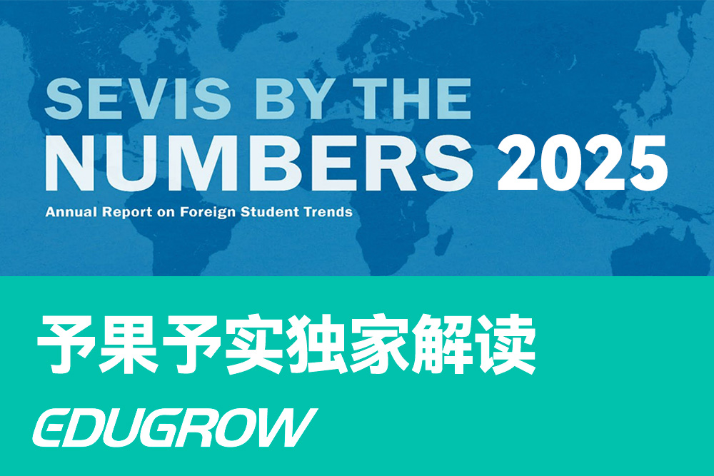
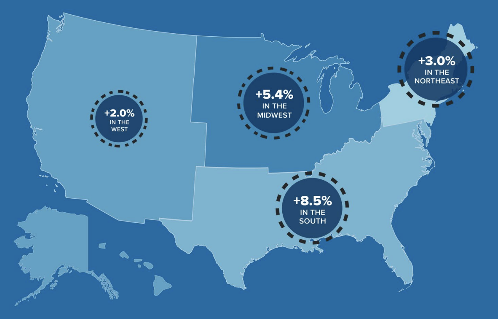
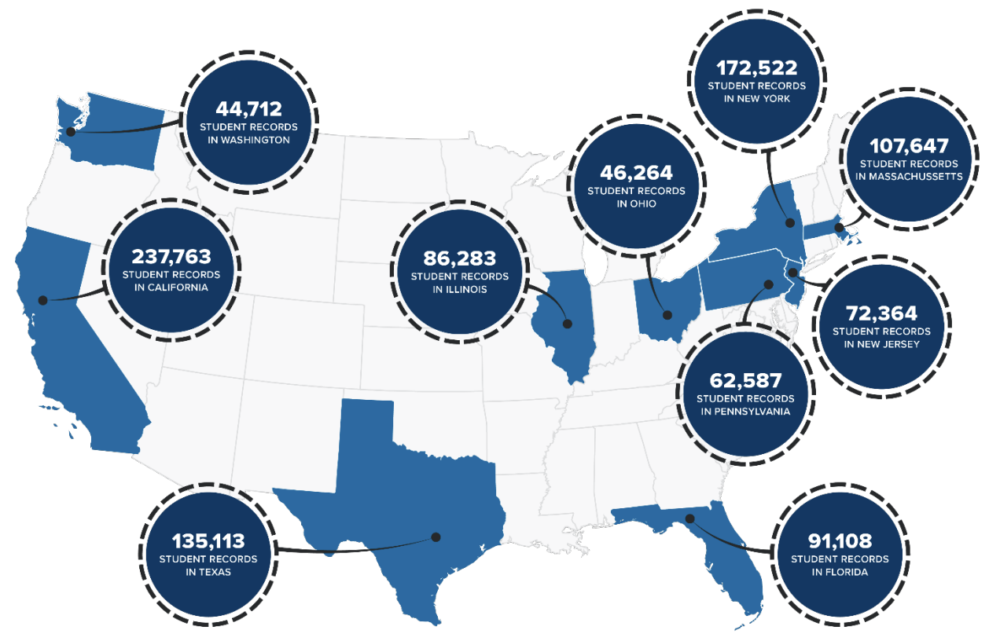
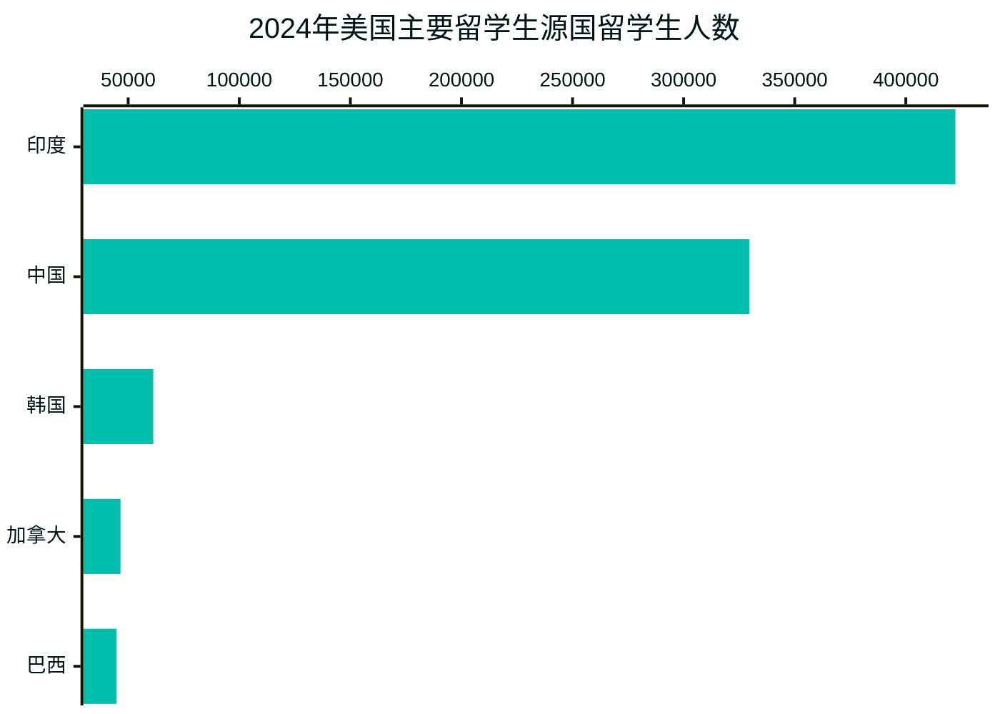
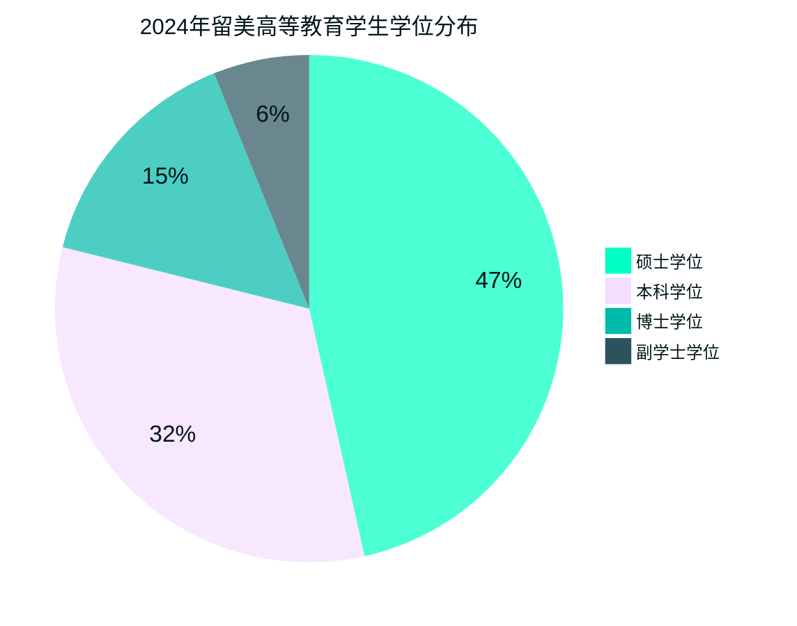
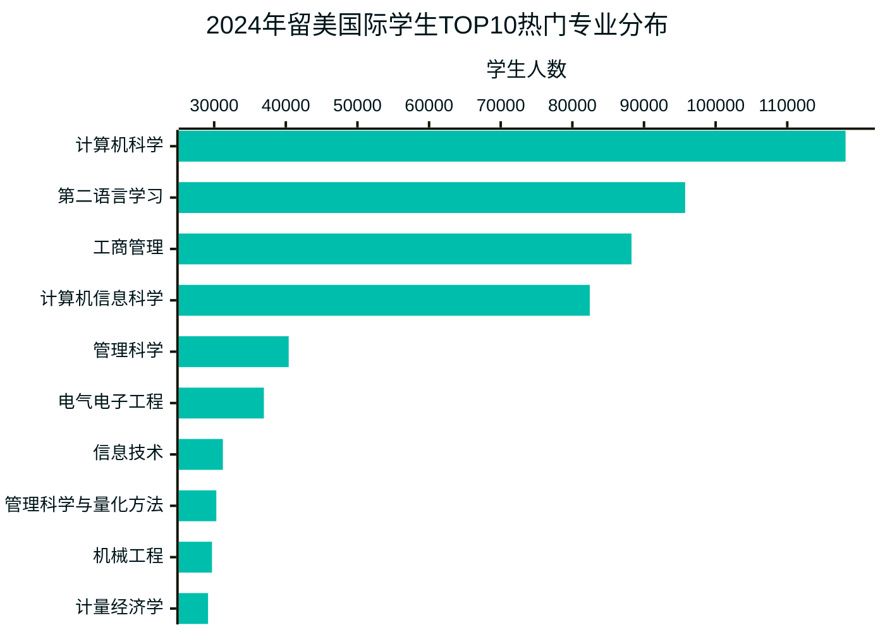

亲爱的同学们和家长朋友们：

我们予果予实顾问团队很高兴为大家带来这份基于美国移民及海关执法局（ICE）2025年6月5日最新发布的《SEVIS by the Numbers》报告的深度解读。这不仅仅是一份数据汇总，更是我们为每一位关心留学之路的你精心准备的实用指南。

报告原文：https://www.ice.gov/doclib/sevis/btn/25_0605_2024-sevis-btn.pdf

---

## 摘要：留学新时代，我们该如何把握机遇？

2024年的数据为我们展示了美国留学市场正在发生的重大变化。就像一幅清晰的全景图，它告诉我们：虽然留学生总人数（1,582,808人）仍保持着5.3%的稳定增长，但留学的内在动力、生源国分布和热门专业都在悄悄改变。

也许你已经听说，**印度首次超越中国成为第一大生源国**。但请不要为此感到焦虑！这个变化背后有着深刻的原因，也为我们中国学生提供了重新思考自己定位的机会。同时，数据显示**硕士教育和STEM专业的实习机会（OPT）正迎来前所未有的增长**，这对有明确目标的你来说，意味着更多的可能性！

在这份报告中，我们不只是分享数据，还要帮你看清这些数字背后的真相，并提供实用的留学规划建议，让你的留学之路既有高度，也有温度。

---

## 一：留学市场新趋势——优质教育资源正在重新分配

数据显示，全美留学生总数达到1,582,808人，同比增长5.3%。这个数字虽然不错，但相比去年10.4%的增长已经明显放缓了。这意味着什么呢？简单来说，疫情后的报复性增长已经结束，市场正在回归理性。

有一个小细节值得我们关注：**美国认证学校的数量减少了449所**（从7,683所降到了7,234所）。

- **这对你意味着什么？** 别担心，这其实是好消息！那些实力不足、教学质量差的学校正在被淘汰，优质的教育资源正在向更好的学校集中。对你来说，这意味着选校时的"安全感"提高了——即使不是顶尖名校，获得认证的学校整体质量也在提升。

### 美国哪些地区的留学生在增长？

美国四大区域的留学生数量都在增长，但速度各不相同。根据2024年SEVIS报告，各地区留学生分布情况如下：

| 地区 | 2024年学生数 | 占比 | 增长率 | 予果予实温馨提示 |
| :--- | :--- | :--- | :--- | :--- |
| **南部 (德州、佛州等)** | **471,293** | **28.9%** | **+8.5%** | 经济发展快，生活成本低，新兴科技中心多 |
| **东北部 (纽约、麻省等)** | **461,192** | **28.3%** | **+3.0%** | 传统名校集中，但竞争激烈 |
| **西部 (加州等)** | **379,970** | **23.3%** | **+1.8%** | 科技产业发达，但增长最慢，竞争最激烈 |
| **中西部 (伊利诺伊、密歇根等)** | **314,076** | **19.3%** | **+5.9%** | 高性价比的教育资源，性价比极高的"蓝海" |

**给你的小建议**

如果你想避开激烈竞争，可以考虑南部和中西部的优质学校。德州的奥斯汀、佛罗里达的迈阿密，以及中西部的芝加哥、安娜堡等地区，都有不少高质量但申请压力相对较小的好学校，而且生活成本通常比东西海岸低。

---

## 二：中印留学生对比——我们的差异与优势

2024年最大的新闻是：印度（422,335人）首次超过中国（329,541人）成为美国第一大留学生来源国。

但这真的是坏消息吗？让我们一起来看看中印留学生的本质差异：

### 中印留学生的五大不同点

| 对比维度 | 🇮🇳 印度留学生 | 🇨🇳 中国留学生 | 这对你意味着什么？ |
| :--- | :--- | :--- | :--- |
| **学习阶段** | 以硕士为主 | **本科、硕士、博士、K-12全面发展** | 我们的教育布局更全面，起点更早，选择更多样 |
| **专业选择** | **极度集中在计算机和IT** | **商科、计算机、经济学多元分布** | 我们的专业选择更加多元化，不必局限于单一赛道 |
| **地区分布** | 加州、德州、伊利诺伊州 | 加州、纽约州、马萨诸塞州 | 我们更倾向于传统教育强州，可以考虑新兴地区分散竞争 |
| **性别比例** | 男生多（62%）女生少（38%） | **男女比例接近平衡（52:48）** | 我们的教育机会更加平等，女生在留学中表现出色 |
| **就业取向** | **48%在STEM领域实习** | 20.4%在STEM领域实习 | 我们的就业方向更加多元，可以在非STEM领域寻找差异化竞争 |

**予果予实温馨提示**

印度留学生的增长主要集中在硕士阶段的计算机和IT专业，这是一种非常聚焦的策略。而我们中国学生则在各个教育阶段都有布局，从K-12到博士，从商科到工程，分布更加均衡。

这种差异不是好坏之分，而是不同的教育理念和职业规划。对你来说，重要的是找到适合自己的定位，而不是盲目跟风或焦虑于排名变化。

---

## 三：学位与专业选择——找到最适合你的赛道

在美国的国际学生中，91%都在攻读高等教育学位（从副学士到博士）。让我们看看不同学位的受欢迎程度：

### 各学位的国际学生分布

| 学位类型 | 学生人数 | 增长率 | 对你的启示 |
| :--- | :--- | :--- | :--- |
| **硕士学位** | **667,622** | **+9.7%** | 增长最快！就业导向的硕士项目是当前最热门选择 |
| **本科学位** | **464,843** | **+1.5%** | 稳定增长，竞争依然激烈，需要全面的规划 |
| **博士学位** | **214,824** | **+4.1%** | 稳定增长，研究型人才需求依然强劲 |
| **副学士学位** | **87,459** | **+9.8%** | 增长显著，但占比仍然较小 |

**给你的小贴士**

硕士学位（尤其是就业导向的专业硕士）正成为留学的"黄金赛道"。如果你想提升就业竞争力，一个精心选择的硕士项目可能是投资回报率最高的选择。

### 热门专业背后的就业逻辑

从上图可以看出，计算机科学以超过11.8万的留学生人数遥遥领先，其次是第二语言学习和工商管理专业。这些数据反映了当前全球就业市场的需求和趋势，也为留学生的专业选择提供了重要参考。

### 予果予实解读

1. **数据驱动的专业选择**：从数据可以看出，计算机科学（118,137人）遥遥领先，其次是第二语言学习（95,747人）和工商管理（88,257人）。这反映了全球数字化转型和商业发展的主流趋势。

2. **技术与管理的融合**：注意到计算机信息科学（82,434人）和管理科学（40,403人）也位列前五，表明技术与管理知识的结合正成为就业市场的热点需求。

3. **工程学科的稳定需求**：电气电子工程（36,939人）和机械工程（29,698人）虽然人数不及计算机科学，但仍然是稳定且受欢迎的选择，特别适合有理工背景的学生。

4. **量化分析能力的价值**：管理科学与量化方法（30,301人）和计量经济学（29,146人）的高排名表明，具备数据分析能力的商科和经济学专业正受到越来越多的青睐。

5. **差异化竞争策略**：
   - **对计算机专业学生**：考虑将技术专长与特定行业知识结合，如金融科技、医疗信息学或教育技术等。
   - **对商科专业学生**：强化数据分析和技术应用能力，如商业分析、供应链管理或数字营销等方向。
   - **对工程专业学生**：关注新兴交叉领域，如可持续工程、智能制造或机器人工程等。

6. **STEM认证的战略价值**：选择STEM认证的专业不仅能获得3年OPT实习期，还能在就业市场上获得更多机会。即使在传统非STEM领域，也可以寻找具有STEM认证的相关专业，如**商业分析**、**管理科学**、**计算社会科学**等。

7. **长远职业规划**：专业选择应与个人职业规划相结合，考虑行业发展趋势、个人兴趣和优势，以及未来的移民和就业可能性，做出最适合自己的选择。

---

## 四：K-12低龄留学——如何让孩子真正融入而非简单"送出去"

在美国K-12阶段的国际学生中，中国学生以14,515人占据了26.7%的主导地位。这个数字背后，有哪些值得家长关注的问题？

### K-12留学生源国TOP5

| 排名 | 国家 | 学生人数 | 占比 | 予果予实家长提示 |
| :---: | :--- | :---: | :---: | :--- |
| 1 | **中国** | **14,515** | **26.7%** | 优势明显，但也要警惕"小中国"现象 |
| 2 | 越南 | 4,252 | 7.8% | 东南亚国家留学生快速增长 |
| 3 | 韩国 | 3,811 | 7.0% | 传统的低龄留学大国 |
| 4 | 墨西哥 | 3,440 | 6.3% | 地理位置优势明显 |
| 5 | 加拿大 | 2,899 | 5.3% | 文化适应难度最小 |

### 给家长的温馨提示

1. **警惕"小中国"现象**：报告中提到一些学校的国际生极为集中，如EF International Academy（1,069人）。这类学校虽然招生简单，但可能会形成"小中国"，孩子的语言环境和文化融入体验会受到影响。选校时，一个有来自20多个国家学生的多元化环境，远比一个80%都是中国学生的环境更有利于孩子的成长。

2. **了解签证规定**：持F-1签证的学生在公立高中最多只能学习12个月，且需支付全额学费。如果计划长期留学，建议直接考虑私立学校。

3. **关注情感支持**：低龄留学最大的挑战不是学术，而是情感适应。选择有完善ESL支持、成熟寄宿家庭项目和导师制度的学校，能让孩子更顺利地度过适应期。

---

## 五：实习与就业——留学投资的回报期到了

OPT（专业实习）是衡量留学投资回报的重要指标。2024年的数据非常亮眼：

* **常规OPT**：145,510人参与，同比增长21.1%
* **STEM OPT延期**：132,192人参与，同比暴增54%！

### 谁在雇佣国际学生？TOP10雇主榜单

| 常规OPT十大雇主 | STEM OPT十大雇主 | 予果予实解读 |
| :--- | :--- | :--- |
| 1. **亚马逊** | 1. **亚马逊** | 科技巨头是国际生最大雇主 |
| 2. 加州大学 | 2. 谷歌 | 大学也是重要雇主，提供研究和行政岗位 |
| 3. 谷歌 | 3. 微软 | 科技公司主导STEM就业市场 |
| 4. 德勤 | 4. 塔塔咨询 | 咨询公司也青睐国际学生 |
| 5. 亚利桑那州立大学 | 5. Infosys | 印度IT公司大量雇佣STEM毕业生 |
| 6. 高盛 | 6. 英特尔 | 金融巨头也在TOP10之列 |
| 7. 微软 | 7. Meta(脸书) | 社交媒体公司提供大量机会 |
| 8. 安永 | 8. 苹果 | 四大会计师事务所是常规OPT大户 |
| 9. **字节跳动(TikTok)** | 9. 特斯拉 | 中资企业也进入TOP榜单！ |
| 10. Infosys | 10. **字节跳动(TikTok)** | 新能源企业成为新兴雇主 |

### 予果予实解读

1. **亚马逊效应**：亚马逊在两个榜单上都排名第一，是国际生就业的"超级雇主"。它招聘范围广泛，从技术到运营，从数据到商业分析，几乎各个专业的学生都有机会。亚马逊的全球化战略也意味着它更愿意雇佣具有多元文化背景的国际学生。

2. **大学也是雇主**：加州大学和亚利桑那州立大学等高校自身也是OPT大户。这提醒我们，毕业后可以考虑留校担任研究助理或行政人员，这是积累美国工作经验的好途径。大学环境对国际学生更友好，签证支持更完善，是稳妥的第一份工作选择。

3. **中资企业崛起**：字节跳动（TikTok）同时登上两个榜单，这对中国学生是个好消息！它既能让你利用国际化背景，又有文化上的亲近感，是"第三条路径"的代表。随着更多中国企业国际化，这类机会将持续增加。

4. **行业多元化**：榜单显示，科技（亚马逊、谷歌、微软、Meta、苹果）、咨询（德勤、塔塔咨询）、金融（高盛、安永）、新能源（特斯拉）等多个行业都欢迎国际学生。这意味着不同专业背景的留学生都有机会找到合适的雇主。

5. **印度IT公司影响力**：Infosys在两个榜单上均有出现，塔塔咨询也位列STEM OPT前列，表明印度IT服务公司是国际学生，尤其是计算机专业毕业生的重要就业渠道。这些公司通常有更成熟的国际人才招聘体系。

6. **申请策略建议**：
   - **多元化申请**：不要仅盯着科技巨头，咨询、金融和教育机构也是不错的选择
   - **校友网络**：利用学校与这些TOP雇主的校友关系，参加校园招聘活动
   - **专业对口**：根据榜单特点，调整个人简历和求职方向，如计算机专业可重点关注科技公司和印度IT企业
   - **实习转正**：这些大型雇主通常有实习项目，通过实习转正是获得全职offer的有效途径

7. **未来趋势预测**：随着人工智能和新能源行业发展，特斯拉等企业将提供更多机会；同时，随着全球化趋势，像字节跳动这样的国际化中资企业将成为连接中美就业市场的重要桥梁。

---

## 六：予果予实给你的贴心建议

基于以上分析，我们为不同阶段的你提供最实用的建议：

### 1. 研究生申请：差异化是你的制胜法宝

* **发挥"软实力"优势**：在CS/DS等热门专业上，与印度申请者硬碰硬并不明智。你的优势在于**全面发展的综合素养**。在文书和面试中，除了技术能力，还要突出你的跨文化沟通能力、团队协作经历和商业思维。一份在中国互联网公司的产品或运营实习，可能比单纯的编程项目更能让你脱颖而出。

* **探索"STEM+"交叉专业**：如果你不是计算机科学专业出身，不必硬转码。有很多"STEM认证"的交叉学科专业同样有3年OPT，且竞争没那么激烈：
  * 喜欢商科？试试**商业分析**、**金融科技**或**管理科学**
  * 对社会科学感兴趣？看看**计算社会科学**或**数字人文**
  * 热爱艺术设计？**交互设计**、**用户体验**也是STEM认证专业

* **用数据驱动选校**：不要只盯着U.S. News排名。结合本报告的地区增长数据和就业机会，寻找**教育质量×就业机会×生活成本**三者平衡的学校。例如：
  * 德州奥斯汀的德克萨斯大学：科技+能源双重就业市场
  * 北卡教堂山的北卡大学：生物医药产业集群+较低生活成本
  * 亚特兰大的佐治亚理工：顶尖工科+南部经济中心+友好的国际生政策

### 2. 本科申请：灵活性是你最大的保障

* **选择"成长型"大学平台**：本科四年，你会经历很多变化和成长。与其赌一个专业，不如选择一个能让你自由探索的平台。优先考虑：
  * **课程设置灵活**：开放式课程体系，容易转专业或双专业
  * **实习资源丰富**：与企业合作紧密，提供带学分的实习机会
  * **就业支持完善**：强大的校友网络和职业发展中心

* **从大一就开始职业规划**：
  * **大一**：适应学习环境，参加校内活动和学生组织，建立人脉
  * **大二**：申请校内工作，尝试第一份暑期实习
  * **大三**：全力冲刺高质量实习，为毕业后就业铺路
  * **大四**：争取实习转正，或准备研究生申请

* **充分利用你付出的学费**：既然85.1%的国际生是自费留学，就要让每一分钱都值得！主动使用学校的各种资源：
  * 写作中心：免费帮你修改论文和简历
  * 辅导中心：提供一对一学术辅导
  * 心理咨询：帮助你应对压力和文化冲击
  * 职业服务：模拟面试、职业规划咨询

### 3. K-12留学：家长必读的三大关键点

* **选择真正国际化的学校**：不是所有"国际学校"都真正国际化。考察学校时，请问这些问题：
  * "贵校的国际生来自多少个国家？各国学生比例如何？"
  * "中国学生在校内有没有抱团现象？学校如何促进跨文化交流？"
  * "学校的ESL支持是什么样的？是独立课程还是融入式教学？"

* **重视情感支持系统**：低龄留学最大的挑战是情感适应。确保学校有：
  * 经过严格筛选和培训的寄宿家庭
  * 专门负责国际生的辅导员
  * 定期的家长沟通机制
  * 心理健康支持服务

* **长远规划胜于短期收益**：
  * 从9年级开始，就要规划大学申请路径
  * 平衡学术课程（AP/IB）和课外活动
  * 培养真正的兴趣爱好，而非为申请而做的表面活动
  * 重视英语写作和口语表达能力的培养

## 写在最后的话

亲爱的同学和家长们，2024年的美国留学市场已经告别了"随便申就能去"的时代，2025年进入了需要精准定位和个性化规划的新阶段。这不是挑战，而是机遇——机遇属于那些能够洞察趋势、精准定位、勇于创新的申请者。

### 未来五年留学趋势展望

1. **全球化与本土化并行**：随着地缘政治格局变化，美国留学将呈现"双轨制"发展——一方面，顶尖学府依然保持全球视野；另一方面，部分院校会更加注重服务本土就业市场。中国学生应当关注那些依然坚持国际化战略的院校和城市。

2. **跨学科融合成为主流**：未来最具竞争力的留学生将不再是单一领域的专家，而是能够跨越学科界限、整合多元知识的复合型人才。技术+人文、数据+创意、商业+设计的交叉人才将最受欢迎。

3. **从"就业导向"到"创新导向"**：随着AI等技术革命，单纯追求就业技能的留学策略将逐渐让位于培养创新思维和解决复杂问题能力的教育理念。未来的留学生需要思考："我能创造什么价值？"而非仅仅"我能找什么工作？"

### 给你的三点核心建议

1. **差异化定位胜过同质化竞争**：在印度学生主导的计算机科学等领域，中国学生应当发挥自身在创意思维、跨文化理解和综合素养上的优势，走出一条差异化发展的道路。

2. **长期视角看待短期波动**：留学是人生的长期投资，不要被短期的排名变化或热门专业转变所左右。选择符合自身兴趣、能力和长期职业规划的教育路径，才能获得持久的竞争力。

3. **保持开放心态，拥抱不确定性**：未来十年的就业市场和热门行业可能与今天截然不同。最重要的不是预测未来，而是培养适应变化的能力——批判性思维、持续学习的习惯、跨文化沟通能力，以及在不确定环境中做出决策的勇气。

请记住，数据和排名只是参考，最重要的是找到适合自己的道路。每个人的留学故事都是独一无二的，没有放之四海而皆准的"最佳方案"。在这个变革的时代，最宝贵的品质是保持清醒的自我认知，以及不断探索和调整的勇气。

我们予果予实团队会一直陪伴在你身边，不仅提供专业的数据分析和申请指导，更会以温度和洞察力，帮你在这片充满机遇与挑战的土地上，书写属于自己的精彩篇章。

愿你的留学之路，既有远见的高度，也有脚踏实地的温度！
