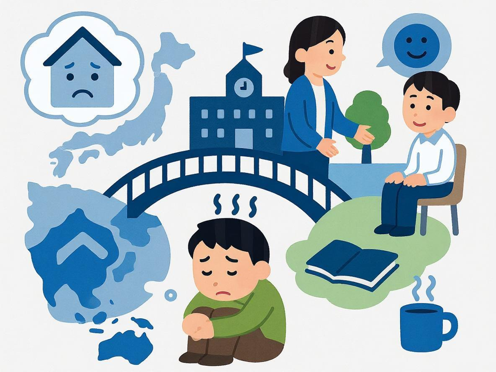

留学生活是一段充满挑战与成长的旅程。远离家人和熟悉的环境，面对陌生的文化和教育体系，许多留学生会经历各种心理调适问题。根据研究，超过70%的国际学生在留学期间会经历不同程度的心理压力和情绪波动。予果予实留学顾问团队深知心理健康对留学成功的重要性，特别整理了这份留学生心理健康指南，帮助你在海外学习期间保持积极健康的心态。

## 常见的留学生心理挑战

### 文化冲击与适应压力

初到异国他乡，文化差异往往是第一个需要面对的挑战：

- **语言障碍**：即使通过了语言考试，在日常交流和学术环境中使用外语仍可能带来压力和挫折感。

- **社交习惯差异**：不同文化背景下的社交规则和人际互动方式存在差异，可能导致误解和社交焦虑。

- **生活方式调整**：从饮食习惯到作息时间，从休闲活动到节假日庆祝，生活方式的改变需要时间适应。

> 文化冲击是留学过程中的自然现象，几乎每位国际学生都会经历，关键在于如何积极应对并从中成长。

### 学业压力与自我怀疑

留学生常面临比国内更大的学业挑战：

- **教育体系差异**：不同国家的教学方法、评估标准和学术要求存在显著差异，需要时间适应。

- **语言相关挑战**：用非母语完成学术任务，如论文写作、课堂讨论和考试，往往需要付出更多努力。

- **高期望压力**：来自家庭、自我和经济投入的高期望，可能导致过度焦虑和完美主义倾向。

### 思乡情绪与孤独感

远离家人和朋友网络是留学生普遍面临的情感挑战：

- **重要时刻的缺席**：无法参与家庭重要时刻和传统节日庆祝，可能加剧思乡之情。

- **社会支持减少**：缺乏熟悉的社会支持系统，在面对困难时感到孤立无援。

- **身份认同问题**：在异国文化中可能产生身份认同的困惑，既不完全融入当地文化，又与原有文化产生距离。

## 有效的心理调适策略

### 建立健康的生活习惯

良好的生活习惯是心理健康的基础：

- **规律作息**：保持规律的睡眠和饮食习惯，为身心健康奠定基础。

- **适度运动**：定期进行体育锻炼，释放压力荷尔蒙，改善情绪状态。研究表明，每周至少150分钟的中等强度运动可显著改善心理健康。

- **均衡饮食**：注意饮食营养均衡，适当补充维生素D（特别是在阳光不足的国家）和Omega-3脂肪酸等有益心理健康的营养素。

### 积极的社交策略

建立新的社交网络对缓解孤独感至关重要：

- **参与校园活动**：积极参加学校组织的迎新活动、学生社团和志愿服务，拓展社交圈。

- **寻找文化桥梁**：参加国际学生组织或华人学生会等，既能获得文化认同感，又能接触多元文化。

- **语言交换**：参与语言交换项目，既能提升语言能力，又能结交当地朋友。

- **保持联系**：定期与家人和老朋友视频通话，维持重要的情感连接，但也要避免过度依赖这些联系而忽视当地社交。

### 学业压力管理

有效管理学业压力是留学成功的关键：

- **合理规划**：制定详细的学习计划，将大任务分解为小目标，避免拖延和临时抱佛脚。

- **主动求助**：充分利用学校提供的学术支持资源，如写作中心、辅导课程和教授办公时间。

- **学习技巧提升**：参加学习技巧工作坊，提高笔记方法、时间管理和考试准备等能力。

- **设定合理期望**：接受初期可能出现的学业调整期，避免过度苛责自己。

### 情绪管理与心理调适

学会识别和管理负面情绪是心理健康的重要技能：

- **正念冥想**：每天进行10-15分钟的正念练习，提高专注力和情绪觉察能力。多项研究证明，正念练习能有效降低焦虑和抑郁症状。

- **情绪日记**：记录每日情绪变化和触发因素，增强自我认知和情绪管理能力。

- **积极思维培养**：学习认知重构技术，挑战消极思维模式，培养更加积极和弹性的思维方式。

- **寻求专业帮助**：当情绪问题持续影响日常生活和学习时，不要犹豫寻求专业心理咨询。

## 何时寻求专业帮助？

以下情况建议寻求专业心理健康支持：

1. **持续的情绪低落**：连续两周以上感到悲伤、空虚或绝望。

2. **严重的焦虑症状**：过度担忧、惊恐发作或无法控制的恐惧感。

3. **睡眠问题**：长期失眠或睡眠过多，影响日常功能。

4. **社交退缩**：明显减少社交活动，回避人际互动。

5. **学业表现显著下降**：无法集中注意力，学习动力严重不足。

6. **自伤或自杀想法**：出现任何伤害自己的想法或计划。

## 留学生可利用的心理健康资源

大多数留学目的地都提供多种心理健康支持资源：

- **校内心理咨询中心**：几乎所有大学都设有心理健康服务，提供免费或低费用的咨询服务，部分学校甚至提供多语言咨询。

- **国际学生办公室**：专门为国际学生提供支持和资源，帮助解决文化适应问题。

- **线上心理健康平台**：如BetterHelp、TalkSpace等提供远程心理咨询服务，部分平台有中文咨询师。

- **社区心理健康服务**：许多城市提供社区心理健康服务，费用通常低于私人诊所。

- **危机热线**：各国都设有24小时心理危机干预热线，提供紧急支持。

在予果予实（EDUGROW），我们深知留学不仅是学术的追求，更是全人发展的旅程。我们的顾问团队不仅关注学生的申请和学业规划，更注重学生的心理健康和全面适应。我们为每位学生提供出国前的心理准备指导，并在留学期间持续提供情感支持和调适建议，确保学生能够健康、快乐地完成留学之旅。

留学路上，你并不孤单。保持开放的心态，积极寻求支持，相信自己的适应能力，你将在这段跨文化旅程中收获成长与蜕变。愿每位留学生都能在追求知识的同时，保持心灵的健康与平静！
