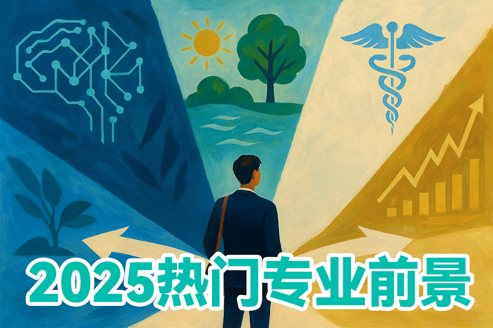

在规划留学时，专业选择是一个至关重要的决策，它不仅关系到你未来几年的学习内容，更直接影响你的职业发展轨迹和人生格局。根据全球教育咨询机构QS的最新调查，超过78%的留学生认为专业选择对其未来职业发展的影响超过了学校排名。

当今世界正经历前所未有的变革——人工智能重塑各行各业，气候变化挑战传统发展模式，全球化与逆全球化力量交织碰撞，人口结构变迁引发社会需求转变。这些宏观趋势正在创造全新的职业机会，同时也淘汰着传统岗位。

予果予实留学顾问团队通过分析全球500强企业招聘趋势、各国政府产业政策导向、顶尖高校专业设置调整以及LinkedIn等职业平台的就业数据，为大家带来2024年全球热门留学专业的深度解析。我们不仅关注当下的就业热点，更着眼于未来5-10年的发展潜力，帮助学生在瞬息万变的全球就业市场中把握先机。

## 人工智能与数据科学：塑造未来的核心力量

人工智能和数据科学已从实验室走向各行各业的前沿，成为驱动全球创新的核心引擎。根据世界经济论坛发布的《未来就业报告》，AI与数据科学相关岗位在未来五年内预计增长率高达71%，远超其他领域。

### 专业内涵与分支方向

人工智能与数据科学是一个广泛的学科领域，根据不同院校的课程设置和研究重点，通常可分为以下几个主要方向：

- **机器学习工程**：专注于开发和优化能够从数据中学习的算法和模型
- **自然语言处理**：研究计算机理解、生成和处理人类语言的技术
- **计算机视觉**：致力于使计算机能够理解和处理视觉信息
- **数据科学与分析**：侧重于从大规模数据中提取洞见和知识
- **AI伦理与治理**：研究人工智能的社会影响、伦理问题和监管框架

### 课程体系与学习路径

顶尖院校的AI与数据科学专业通常提供系统而全面的课程体系：

- **基础课程**：高等数学（线性代数、微积分、概率论与数理统计）、计算机科学基础、数据结构与算法、编程语言（Python、R、Julia等）

- **核心专业课**：机器学习算法、深度学习架构、神经网络设计、大数据处理框架、分布式计算系统、强化学习、贝叶斯方法

- **应用领域课程**：推荐系统、自动驾驶技术、医疗AI应用、金融量化分析、智能机器人、计算语言学

- **实践项目**：产学合作项目、开源贡献、AI竞赛（如Kaggle）、行业实习

一位在卡内基梅隆大学攻读机器学习硕士的中国学生分享道："与国内教育相比，美国AI专业更注重实践和创新。我们每周都有编程作业和项目，学期项目通常要求解决实际问题或复现最新研究成果。教授们鼓励我们质疑现有方法，提出自己的想法。"

### 顶尖院校与录取难度

全球AI与数据科学专业的顶尖院校录取竞争异常激烈，以下是部分知名项目及其特点：

- **美国**：
  - 斯坦福大学（计算机科学-人工智能方向）：录取率约2-3%，强调研究创新能力
  - 麻省理工学院（电子工程与计算机科学）：注重跨学科融合，与媒体实验室合作紧密
  - 卡内基梅隆大学（机器学习系）：全球首个专注机器学习的独立院系，理论基础极强
  - 加州大学伯克利分校（电气工程与计算机科学）：与硅谷联系紧密，创业氛围浓厚

- **英国**：
  - 剑桥大学（机器学习与机器智能MPhil）：理论与实践并重，录取率约8%
  - 牛津大学（计算机科学-机器学习方向）：强调AI伦理与社会影响研究
  - 帝国理工学院（人工智能与机器学习MSc）：应用导向，与工业界合作项目多

- **加拿大**：
  - 多伦多大学（计算机科学-机器学习方向）：拥有Geoffrey Hinton等深度学习先驱
  - 滑铁卢大学（数据科学与人工智能）：与加拿大AI研究所合作紧密

- **亚洲**：
  - 新加坡国立大学（人工智能硕士）：东南亚地区顶尖AI项目，全球视野
  - 香港科技大学（大数据技术理学硕士）：结合中西方教育优势，就业网络广泛

录取这些顶尖项目通常需要申请者具备扎实的数学基础、优秀的编程能力、相关研究或项目经验，以及清晰的研究兴趣。GRE定量部分通常要求168+，托福100+或雅思7.0+。

### 就业前景与薪资水平

AI与数据科学毕业生的就业前景极为广阔，且薪资水平显著高于其他领域：

- **科技巨头**：谷歌、微软、亚马逊、Meta等公司的AI研究员和机器学习工程师起薪通常在15-20万美元/年，资深人才可达30万美元以上

- **金融科技**：对冲基金、高频交易公司和投资银行的量化分析师和AI研究员薪资范围在18-25万美元/年

- **医疗健康**：医疗AI研究员和数据科学家薪资在12-18万美元/年，且工作稳定性高

- **自动驾驶**：Waymo、特斯拉等自动驾驶公司的AI工程师薪资在16-22万美元/年

- **初创企业**：AI创业公司通常提供有竞争力的薪资加股权组合，具有较高的长期收益潜力

根据LinkedIn的全球就业数据，AI与数据科学专业毕业生的就业率超过95%，其中超过80%的人在毕业后3个月内找到工作。值得注意的是，不同国家和地区的薪资水平存在差异，美国硅谷地区提供的薪资通常最高，但生活成本也相应较高。

### 行业趋势与未来发展

AI与数据科学领域正经历快速演变，以下趋势值得关注：

- **生成式AI的崛起**：ChatGPT等大型语言模型的成功标志着生成式AI的爆发，相关人才需求激增

- **AI民主化与垂直应用**：随着开发工具的简化和专业化，各行业对具备领域知识的AI人才需求增长

- **多模态AI系统**：整合视觉、语言、音频等多种输入的AI系统成为研究热点

- **AI伦理与可解释性**：随着AI应用的普及，对透明、公平、可解释AI的需求日益增长

- **边缘计算与嵌入式AI**：将AI能力部署到终端设备的技术正快速发展

一位在谷歌担任AI研究员的业内专家表示："未来最抢手的人才将是那些既掌握AI技术核心，又深入理解特定行业需求的'双料专家'。纯粹的算法工程师固然重要，但能够将AI技术与医疗、金融、教育等领域深度结合的复合型人才将更具竞争力。"

### 学生案例与经验分享

**张明（化名）**，清华大学计算机本科毕业，现就读于斯坦福大学计算机科学硕士项目（AI方向）：

>"申请过程中，我发现美国顶尖院校非常看重研究经历和项目实践。我在本科期间参与了两个研究项目，一个是与微软亚洲研究院合作的自然语言处理项目，另一个是校内实验室的计算机视觉研究。这些经历在申请中起到了关键作用。在斯坦福的学习节奏非常紧凑，每周至少60小时的学习时间，但收获也非常大。这里的课程设计紧跟前沿，许多作业都是复现最新论文或解决实际问题。最让我惊喜的是与业界的紧密联系，几乎每周都有科技公司的技术讲座和招聘活动。"

**李婷（化名）**，香港科技大学数据科学与技术硕士毕业，现就职于新加坡某金融科技公司：

>"我选择香港科技大学是看中其在亚洲的学术声誉和广泛的就业网络。课程内容兼具理论深度和实践导向，我特别喜欢与金融机构合作的实际项目。毕业后，我收到了来自新加坡、香港和上海的多个offer，最终选择了新加坡的金融科技公司，主要负责开发交易算法和风险模型。我的建议是，除了课堂学习，一定要积极参与行业实习和竞赛，这些经历能极大提升就业竞争力。"

> **专家建议**：人工智能与数据科学不仅需要扎实的数学和编程基础，还需要培养批判性思维、创新能力和跨学科视野。随着AI技术的普及，纯粹的技术实现能力将逐渐商品化，而问题定义、模型解释和商业价值转化的能力将变得更加珍贵。对有志于此领域的学生，建议在本科阶段打好数学和计算机基础，同时培养特定领域的专业知识，形成独特的竞争优势。

## 可持续发展与环境科学：守护地球的前沿力量

在全球气候变化加剧、生物多样性锐减、资源短缺日益严峻的背景下，可持续发展与环境科学专业正迎来前所未有的发展机遇。联合国《2030年可持续发展议程》的推进和各国碳中和承诺的落实，正在创造大量与环境保护和可持续发展相关的就业岗位。据国际劳工组织预测，到2030年，全球绿色经济转型将创造2400万个新就业岗位。

### 学科内涵与分支方向

可持续发展与环境科学是一个高度跨学科的领域，融合了自然科学、社会科学和工程技术的知识体系。根据专业侧重点不同，主要可分为以下几个方向：

- **环境科学与生态学**：研究生态系统运行机制、污染物迁移转化、生物多样性保护等基础科学问题

- **环境工程与污染控制**：专注于开发控制和减少环境污染的技术和方法，如水处理、大气污染控制、土壤修复等

- **可再生能源与清洁技术**：研究太阳能、风能、生物质能等可再生能源技术及其系统集成

- **可持续城市与区域规划**：探索城市和区域可持续发展模式，包括绿色建筑、智慧城市、低碳交通等

- **环境政策与管理**：研究环境法规、政策制定、环境影响评价、企业可持续发展战略等

- **气候变化科学与适应**：研究气候变化机制、影响评估和适应策略

- **绿色金融与可持续投资**：探索将环境、社会和治理(ESG)因素纳入投资决策的方法和工具

### 课程体系与学习内容

顶尖院校的可持续发展与环境科学专业通常提供多元化的课程设置：

- **基础科学课程**：生态学原理、环境化学、大气科学、水文学、地球系统科学

- **技术与工程课程**：环境监测技术、污染控制工程、可再生能源系统、环境建模与模拟

- **政策与管理课程**：环境法律与政策、环境经济学、企业可持续发展战略、环境影响评价

- **研究方法课程**：环境数据分析、地理信息系统(GIS)、生命周期评价、环境风险评估

- **实践与实习**：野外调查、实验室分析、企业实习、国际组织实践

一位在耶鲁大学环境学院就读的国际学生分享："耶鲁的环境项目最吸引我的是其跨学科特性和实践导向。我们的课程由来自十多个不同学院的教授共同授课，从科学家到政策专家，从工程师到经济学家，提供了全方位的视角。每个学期都有实地考察和案例研究，让我们将理论知识应用到实际环境问题中。"

### 顶尖院校与特色项目

全球范围内，许多顶尖大学都开设了特色鲜明的可持续发展与环境科学项目：

- **美国**：
  - 耶鲁大学（环境学院）：全球最古老的环境学院之一，强调跨学科研究和政策实践
  - 斯坦福大学（地球系统科学）：结合自然科学和社会科学，研究地球系统与人类活动的相互作用
  - 哥伦比亚大学（气候与社会）：专注于气候变化的社会经济影响研究
  - 加州大学伯克利分校（能源与资源）：在可再生能源和资源管理领域处于领先地位

- **英国**：
  - 牛津大学（环境变化研究所）：侧重环境变化的科学研究和政策分析
  - 剑桥大学（可持续领导力硕士）：培养可持续发展领域的领导者和变革推动者
  - 爱丁堡大学（碳管理）：全球首个专注于碳管理的硕士项目
  - 伦敦政治经济学院（环境政策与监管）：环境政策和经济分析的权威项目

- **澳大利亚**：
  - 墨尔本大学（可持续发展）：结合科学、工程和社会科学的综合项目
  - 昆士兰大学（环境管理）：在热带和海洋生态系统研究方面享有盛誉
  - 澳大利亚国立大学（气候变化）：与政府部门合作紧密的气候政策研究

- **欧洲大陆**：
  - 苏黎世联邦理工学院（环境科学与工程）：瑞士顶尖工程学院的环境项目
  - 瓦赫宁根大学（环境科学）：荷兰著名的生命科学和农业大学
  - 隆德大学（环境科学与可持续发展）：瑞典领先的环境研究中心

- **亚洲**：
  - 东京大学（可持续发展科学）：日本顶尖的可持续发展研究项目
  - 香港大学（可持续城市发展）：专注于亚洲城市可持续发展的研究
  - 新加坡国立大学（环境管理）：结合亚洲视角的环境管理项目

这些项目的录取要求各不相同，但通常看重申请者的学术背景、研究经历、环保实践和职业规划。对于理工背景的申请者，相关的实验室或野外研究经验非常重要；对于社会科学背景的申请者，环境政策分析或可持续发展项目的参与经历则更为关键。

### 就业前景与职业路径

可持续发展与环境科学专业毕业生的就业前景广阔且多元：

- **政府部门**：环境保护局、自然资源部、能源部、城市规划部门等，从事环境政策制定、监管执法、资源管理等工作

- **国际组织**：联合国环境规划署、世界自然基金会、绿色和平组织等，参与全球环境治理和可持续发展项目

- **企业部门**：
  - 环保咨询公司：提供环境影响评价、合规审计、可持续发展战略等专业服务
  - 可再生能源企业：从事太阳能、风能、生物质能等清洁能源技术开发和项目管理
  - 大型企业ESG部门：负责企业环境、社会责任和治理战略的制定和实施

- **研究机构**：环境研究所、气候变化研究中心、可持续发展智库等，开展前沿环境科学研究和政策分析

- **教育部门**：高校和研究机构的教学和研究岗位，培养下一代环境科学人才

薪资水平因地区和具体岗位而异，但总体呈上升趋势。在美国，环境科学家的平均年薪约为7.3万美元，环境工程师约为8.8万美元，可持续发展顾问约为7.5万美元。值得注意的是，随着ESG投资的兴起，金融机构中的可持续发展分析师薪资增长迅速，顶级投资银行的ESG分析师年薪可达10-15万美元。

### 行业趋势与未来发展

可持续发展与环境科学领域正经历深刻变革，以下趋势值得关注：

- **气候技术创新**：碳捕获与封存、氢能技术、先进储能等气候技术领域的投资和创新正在加速

- **循环经济转型**：从线性"开采-制造-使用-丢弃"模式向循环"减量-再用-再生"模式转变，创造新的商业模式和就业机会

- **数字技术赋能**：人工智能、物联网、区块链等数字技术在环境监测、资源管理和可持续供应链中的应用日益广泛

- **自然基础解决方案**：利用自然生态系统应对气候变化和环境挑战的方法受到越来越多关注

- **ESG主流化**：环境、社会和治理因素正成为投资决策和企业战略的核心考量

一位在世界资源研究所工作的专家指出："可持续发展领域正从边缘议题变为主流关注，从道德选择变为经济必然。未来最具竞争力的人才将是那些能够将环境科学知识与商业思维、技术创新和政策洞察相结合的复合型人才。"

### 学生案例与经验分享

**王海（化名）**，北京大学环境科学本科毕业，现就读于哥伦比亚大学气候与社会硕士项目：

>"选择这个专业源于我对气候变化问题的关注和希望为解决环境挑战做出贡献的愿望。申请过程中，我强调了本科期间参与的气候政策研究项目和在环保NGO的实习经历。哥伦比亚的项目非常国际化，我的同学来自30多个国家，这提供了理解全球环境问题的多元视角。课程设置兼顾科学基础和政策应用，我特别喜欢与实际案例结合的项目式学习。毕业后，我希望加入国际气候智库或咨询机构，为发展中国家的低碳转型提供政策建议。"

**玛丽亚（化名）**，墨尔本大学可持续发展硕士毕业，现就职于澳大利亚某可再生能源公司：

>"墨尔本大学的可持续发展项目吸引我的是其实践导向和与产业的紧密联系。在学习期间，我参与了一个与当地政府合作的社区太阳能项目，这不仅加深了我对可再生能源技术的理解，也培养了项目管理和利益相关者沟通的能力。毕业后，我加入了一家太阳能开发公司，负责项目开发和社区参与工作。这个领域最令人兴奋的是，你能够看到自己的工作对减少碳排放和推动能源转型的直接贡献。对想进入这个领域的学生，我建议除了专业知识，也要培养沟通、协作和项目管理等软技能，这些在跨部门合作中非常重要。"

> **专家建议**：可持续发展与环境科学是一个高度跨学科的领域，成功的专业人士通常具备跨越学科边界的能力和系统思维。对有志于此领域的学生，建议在专业学习的同时，培养数据分析能力、政策理解能力和有效沟通能力。此外，亲身参与环保实践和可持续发展项目，不仅能够加深对理论知识的理解，也能够建立宝贵的专业网络和实践经验。

## 医疗健康与生物技术：创新生命科学的无限可能

随着全球人口老龄化加速、慢性病负担加重、新发传染病威胁增加，以及个性化医疗需求上升，医疗健康与生物技术领域正迎来前所未有的发展机遇。COVID-19大流行进一步凸显了生命科学创新的重要性，加速了该领域的投资和技术突破。根据麦肯锡全球研究院预测，到2040年，医疗健康创新有望使全球人均寿命延长6-10年，创造数万亿美元的经济价值。

### 学科内涵与分支方向

医疗健康与生物技术是一个融合生物学、医学、工程学和信息科学的跨学科领域，根据研究重点和应用方向，主要可分为以下几个分支：

- **生物医学工程**：将工程原理和设计方法应用于医学和生物学，开发医疗设备、人工器官、生物材料等

- **生物技术与制药**：利用生物学原理和技术开发新型药物、疫苗和治疗方法，包括基因治疗、细胞治疗、蛋白质工程等

- **公共卫生与流行病学**：研究疾病在人群中的分布规律和影响因素，制定预防和控制策略

- **医疗信息学与数字健康**：利用信息技术改善医疗服务和健康管理，包括电子健康记录、远程医疗、健康数据分析等

- **精准医疗与基因组学**：基于个体基因组信息和生物标志物，开发个性化诊断和治疗方案

- **神经科学与脑研究**：探索神经系统结构和功能，开发神经疾病的诊断和治疗方法

- **再生医学与组织工程**：研究如何修复、替换或再生受损组织和器官

### 课程体系与学习内容

顶尖院校的医疗健康与生物技术专业通常提供系统而全面的课程体系：

- **基础科学课程**：分子生物学、细胞生物学、生物化学、遗传学、微生物学、免疫学、生理学

- **技术与方法课程**：生物技术实验方法、基因组分析、蛋白质组学、生物信息学、生物统计学

- **工程与设计课程**：生物材料、医疗设备设计、组织工程、生物制造、生物传感器

- **临床与转化课程**：疾病机制、药物开发、临床试验设计、监管科学、医疗伦理

- **实践与实习**：实验室轮转、产业实习、临床观察、研究项目

一位在哈佛医学院攻读生物医学博士的学生分享："哈佛的生物医学项目最大的特点是其跨学科性和转化研究导向。我们不仅学习最前沿的生物学知识和技术，还有机会与临床医生和工程师合作，将基础研究转化为临床应用。每周的实验室会议和研讨会让我们直接接触到领域内的顶尖科学家和他们的最新研究成果。"

### 顶尖院校与特色项目

全球范围内，许多顶尖大学都开设了特色鲜明的医疗健康与生物技术项目：

- **美国**：
  - 哈佛大学（生物医学科学）：强调基础研究与临床医学的结合，拥有哈佛医学院和多家顶级教学医院的资源
  - 约翰霍普金斯大学（生物医学工程）：全美排名第一的生物医学工程项目，与顶级医院合作紧密
  - 斯坦福大学（生物工程）：结合生物学和工程学，注重创新和创业
  - 麻省理工学院（生物工程）：技术导向强，与工业界联系紧密
  - 加州大学旧金山分校（生物医学科学）：在转化医学和药物开发领域处于领先地位

- **英国**：
  - 牛津大学（医学科学）：结合基础医学研究和临床医学教育
  - 剑桥大学（生物技术）：强调生物技术的商业化和创业
  - 伦敦大学学院（医学科学与工程）：跨学科研究和国际合作项目丰富
  - 帝国理工学院（生物医学工程）：工程背景强，注重医疗技术创新

- **欧洲大陆**：
  - 苏黎世联邦理工学院（生物技术与生物工程）：瑞士顶尖工程学院的生物医学项目
  - 卡罗林斯卡学院（生物医学）：瑞典著名医学院，诺贝尔生理学或医学奖评选机构
  - 海德堡大学（分子生物技术）：德国顶尖的生命科学研究中心

- **亚洲**：
  - 东京大学（医学系统生物学）：日本顶尖的医学研究项目
  - 新加坡国立大学（生物医学工程）：亚洲领先的生物医学研究中心
  - 香港大学（生物医学科学）：结合东西方医学传统的研究项目

这些项目的录取要求各不相同，但通常看重申请者的科学背景、研究经历和职业规划。对于研究型项目，实验室研究经验尤为重要；对于专业型项目，相关行业实习或工作经验则更具优势。

### 就业前景与职业路径

医疗健康与生物技术专业毕业生的就业前景广阔且多元：

- **生物技术与制药行业**：
  - 研发科学家：负责新药发现、疫苗开发、诊断技术研究等
  - 临床研究员：设计和管理临床试验，评估新药安全性和有效性
  - 生产工艺工程师：优化生物制品的生产工艺和质量控制
  - 监管事务专员：负责药品和医疗器械的注册申报和合规管理

- **医疗器械与健康科技**：
  - 医疗设备工程师：设计和开发医疗设备和诊断仪器
  - 生物传感器专家：开发用于健康监测和疾病诊断的传感技术
  - 医疗软件开发者：开发医疗信息系统、健康应用和远程医疗平台

- **医疗机构与研究中心**：
  - 临床实验室科学家：在医院和诊断中心进行医学检测和分析
  - 转化研究专员：促进基础研究成果向临床应用的转化
  - 生物库管理员：管理生物样本和数据资源

- **公共卫生与政府部门**：
  - 流行病学家：监测和分析疾病传播模式，制定防控策略
  - 健康政策分析师：评估医疗政策和公共卫生干预措施的效果
  - 监管科学家：在药监局等机构评审药品和医疗器械申请

- **学术与教育**：
  - 大学教授和研究员：在高校和研究机构从事教学和科研工作
  - 科学传播专家：负责生命科学和医学知识的普及和传播

薪资水平因地区和具体岗位而异，但总体处于较高水平。在美国，生物医学工程师的平均年薪约为9.2万美元，生物技术研究科学家约为8.5万美元，临床研究经理约为10.5万美元。值得注意的是，随着经验积累和专业发展，高级研发职位和管理岗位的薪资可达15-20万美元以上。

### 行业趋势与未来发展

医疗健康与生物技术领域正经历深刻变革，以下趋势值得关注：

- **基因编辑与基因治疗**：CRISPR等基因编辑技术的突破正在革新遗传疾病的治疗方法

- **细胞治疗与再生医学**：CAR-T细胞疗法等创新治疗方式正在改变癌症等疾病的治疗范式

- **人工智能与精准医疗**：AI技术在医学影像分析、药物发现和个性化治疗方案制定中的应用日益广泛

- **微生物组与免疫治疗**：肠道微生物组研究和免疫疗法正成为疾病治疗的新前沿

- **数字健康与远程医疗**：可穿戴设备、移动健康应用和远程医疗平台正在改变医疗服务的提供方式

- **合成生物学**：设计和构建新型生物系统的能力正在开创生物制造和环境应用的新可能

一位在罗氏制药工作的资深研发主管指出："生物医药领域正经历从'经验驱动'到'数据驱动'的范式转变。未来最具竞争力的人才将是那些既掌握生物学基础知识，又具备数据科学和计算能力的复合型人才。此外，随着行业全球化程度提高，跨文化沟通能力和国际视野也变得越来越重要。"

### 学生案例与经验分享

**陈明（化名）**，复旦大学生物科学本科毕业，现就读于约翰霍普金斯大学生物医学工程硕士项目：

>"选择这个专业源于我对将工程原理应用于医学问题的浓厚兴趣。申请过程中，我强调了本科期间参与的生物传感器研究项目和在一家医疗器械公司的实习经历。霍普金斯的项目非常注重实践和创新，我们有机会直接与医生合作，了解临床需求，并开发解决方案。课程设置兼顾理论基础和实际应用，我特别喜欢设计挑战课程，我们团队正在开发一种用于早期癌症检测的微流控设备。毕业后，我希望加入医疗器械行业，参与开发能够改善患者生活的创新产品。"

**艾米丽（化名）**，伦敦大学学院医学生物技术硕士毕业，现就职于英国一家生物技术创业公司：

>"UCL的生物技术项目吸引我的是其强大的产业联系和创业氛围。在学习期间，我参与了一个与制药公司合作的抗体工程项目，这不仅加深了我对蛋白质工程的理解，也让我了解了产业界的研发流程和标准。毕业后，我加入了一家专注于开发新型免疫疗法的创业公司，负责抗体筛选和优化工作。这个领域最令人兴奋的是，你的工作可能直接改变患者的治疗结果和生活质量。对想进入这个领域的学生，我建议除了扎实的科学知识，也要培养项目管理和团队协作能力，因为生物医药研发通常是高度协作的过程。"

> **专家建议**：医疗健康与生物技术是一个高度创新且监管严格的领域，成功的专业人士通常需要兼具科学严谨性和创新思维。对有志于此领域的学生，建议在专业学习的同时，培养跨学科合作能力和产业洞察力。此外，由于生物医药研发周期长、风险高，耐心和韧性也是这一领域不可或缺的品质。无论是选择学术研究还是产业发展，持续学习的能力都将是长期成功的关键。

## 金融科技与数字经济：重塑全球金融格局

随着数字技术的飞速发展，金融科技（FinTech）正在重塑全球金融服务的格局。传统金融机构、科技巨头和创新创业公司共同推动着这一领域的变革，创造出前所未有的商业模式和服务体验。根据普华永道的研究，到2030年，金融科技有望为全球经济增加约1500亿美元的价值，并显著提高金融服务的可及性、效率和包容性。

### 学科内涵与分支方向

金融科技与数字经济是一个融合金融学、计算机科学、数据分析和商业创新的跨学科领域。根据应用场景和技术特点，主要可分为以下几个分支：

- **支付与交易技术**：移动支付、跨境支付、数字钱包、实时结算系统等

- **区块链与加密资产**：分布式账本技术、智能合约、加密货币、去中心化金融(DeFi)等

- **数字银行与普惠金融**：线上银行、微型金融、普惠金融解决方案等

- **保险科技(InsurTech)**：风险评估模型、自动理赔、参数化保险等

- **监管科技(RegTech)**：合规自动化、风险监测、反洗钱系统等

- **量化金融与算法交易**：高频交易、量化投资策略、风险建模等

- **财富科技(WealthTech)**：智能投顾、资产管理平台、财务规划工具等

- **开放银行与API生态**：开放银行标准、金融API、第三方服务集成等

### 课程体系与学习内容

顶尖院校的金融科技项目通常提供全面而平衡的课程体系，涵盖金融、技术和商业多个维度：

- **金融基础课程**：金融市场与机构、投资学、风险管理、公司金融、金融衍生品

- **技术核心课程**：编程基础(Python/R)、数据库系统、区块链技术、API开发、云计算

- **数据分析课程**：金融数据分析、机器学习应用、大数据处理、预测模型、自然语言处理

- **商业与创新课程**：金融科技商业模式、创业与创新、产品管理、监管与合规、金融伦理

- **实践与项目**：行业实习、创新实验室、创业孵化、案例研究

一位在牛津大学攻读金融科技硕士的学生分享："牛津的金融科技项目最大的特点是其跨学科性和实践导向。我们不仅学习金融理论和编程技能，还有机会与行业领袖和创业者互动，参与真实的金融科技项目。课程设置既有严谨的学术训练，也有创新思维的培养，帮助我们既理解现有金融体系的运作，又能够思考如何利用技术创新解决行业痛点。"

### 顶尖院校与特色项目

全球范围内，许多顶尖大学都开设了特色鲜明的金融科技项目：

- **美国**：
  - 麻省理工学院（金融科技与区块链）：结合MIT金融与计算机科学的强大背景，注重技术创新
  - 斯坦福大学（金融数学与计算金融）：强调数学模型和计算方法在金融中的应用
  - 卡内基梅隆大学（计算金融）：计算机科学与金融的深度融合，算法和模型开发见长
  - 哥伦比亚大学（金融工程）：华尔街近在咫尺，金融业联系紧密
  - 加州大学伯克利分校（金融工程）：硅谷创新文化的影响，金融科技创业氛围浓厚

- **英国**：
  - 牛津大学（金融科技与创新）：结合传统金融研究实力与创新思维
  - 剑桥大学（金融科技与监管）：注重金融科技的监管与政策研究
  - 帝国理工学院（金融科技与数据分析）：技术导向强，数据科学应用深入
  - 伦敦商学院（金融科技与创业）：创业生态系统完善，行业联系紧密

- **亚洲**：
  - 香港大学（金融科技）：亚洲金融中心的区位优势，国际视野广
  - 新加坡国立大学（金融科技与区块链）：政府支持力度大，实验环境开放
  - 北京大学（金融科技与监管）：中国金融科技发展的前沿研究
  - 香港科技大学（金融科技）：技术背景强，与大湾区金融科技生态联系紧密

这些项目的录取要求各不相同，但通常看重申请者的数量分析能力、编程技能和金融知识。对于研究型项目，学术背景和研究潜力更为重要；对于专业型项目，相关行业经验和职业规划则更具优势。值得注意的是，许多顶尖项目对申请者的数学和统计学背景有较高要求。

### 就业前景与职业路径

金融科技与数字经济专业毕业生的就业前景广阔且薪资水平具有竞争力：

- **传统金融机构**：
  - 数字化转型专家：负责银行、保险公司等传统金融机构的技术创新和数字化转型
  - 量化分析师：开发和应用数学模型进行风险评估、定价和投资决策
  - 金融数据科学家：分析大量金融数据，提取洞见，优化业务决策
  - 区块链开发者：设计和实现基于区块链的金融应用和解决方案

- **科技公司与金融科技创业公司**：
  - 产品经理：负责金融科技产品的设计、开发和市场推广
  - 解决方案架构师：设计金融科技系统架构和技术路线
  - 金融API开发者：开发和维护金融服务API和开放银行解决方案
  - 用户体验设计师：优化金融科技产品的用户界面和交互体验

- **咨询与专业服务**：
  - 金融科技咨询顾问：为金融机构提供数字化转型和创新战略咨询
  - 风险与合规专家：帮助企业应对金融科技带来的风险和合规挑战
  - 数字资产评估师：评估数字资产和加密货币相关投资

- **监管机构与研究机构**：
  - 金融科技政策分析师：研究和制定金融科技相关政策和监管框架
  - 创新沙盒管理员：管理监管沙盒项目，评估创新金融产品的风险和效益
  - 中央银行数字货币研究员：研究和开发中央银行数字货币(CBDC)解决方案

薪资水平因地区和具体岗位而异，但总体处于较高水平。在美国，金融科技产品经理的平均年薪约为12万美元，量化分析师约为15万美元，区块链开发者约为13万美元。在伦敦、香港、新加坡等金融中心，金融科技专业人才的薪资也具有很强的竞争力，通常高于当地平均水平30%-50%。

### 行业趋势与未来发展

金融科技与数字经济领域正经历快速变革，以下趋势值得关注：

- **嵌入式金融(Embedded Finance)**：金融服务正越来越多地嵌入到非金融应用和平台中，创造无缝的用户体验

- **去中心化金融(DeFi)**：基于区块链的金融应用正在创建一个不依赖传统中介的金融生态系统

- **中央银行数字货币(CBDC)**：各国央行正在积极研究和试点数字货币，这可能对支付系统和货币政策产生深远影响

- **监管科技与合规自动化**：随着金融监管日益复杂，自动化合规解决方案的需求不断增长

- **人工智能在金融中的应用**：从风险评估到客户服务，AI正在金融服务的各个环节发挥越来越重要的作用

- **可持续金融科技**：将环境、社会和治理(ESG)因素纳入金融决策的技术解决方案正成为新热点

一位在摩根大通负责数字创新的高管指出："金融科技领域正经历从'颠覆'到'融合'的转变。最初，金融科技创业公司试图挑战传统金融机构；而现在，我们看到更多的是合作与共生。未来最具竞争力的人才将是那些既了解传统金融体系的复杂性，又掌握前沿技术的复合型人才。此外，随着金融服务的全球化和数字化，对跨文化理解和用户体验设计的重视也在不断提高。"

### 学生案例与经验分享

**李明（化名）**，清华大学计算机科学本科毕业，现就读于斯坦福大学金融数学硕士项目：

>"选择这个专业源于我对将计算机科学应用于金融问题的浓厚兴趣。申请过程中，我强调了本科期间开发的量化交易算法和在一家金融科技创业公司的实习经历。斯坦福的项目非常注重数学基础和计算技能，课程挑战性很大，但也非常实用。我特别喜欢'金融机器学习'这门课，我们学习如何应用最新的机器学习技术解决金融预测和风险管理问题。毕业后，我希望加入一家量化投资公司或金融科技创业公司，将技术创新应用于投资决策和风险管理。"

**索菲亚（化名）**，伦敦政治经济学院金融学本科毕业，现就职于一家领先的数字银行：

>"LSE的金融背景给了我扎实的理论基础，但我一直对科技如何改变金融服务感兴趣，所以毕业后直接加入了一家数字银行。作为产品经理，我负责设计和优化移动银行应用的用户体验和功能。这个领域最令人兴奋的是，你可以看到自己的工作如何直接改善用户的财务生活。我们正在开发的普惠金融解决方案，能够为传统银行体系难以覆盖的人群提供金融服务。对想进入这个领域的学生，我建议除了金融和技术知识，也要培养设计思维和用户研究能力，因为理解用户需求是创造成功金融科技产品的关键。"

> **专家建议**：金融科技是一个高度创新且监管严格的领域，成功的专业人士通常需要兼具金融洞察力和技术创新能力。对有志于此领域的学生，建议在专业学习的同时，密切关注行业动态和监管变化。此外，由于金融科技的跨学科性质，建立多元化的技能组合和专业网络将有助于把握更广泛的职业机会。无论是选择传统金融机构、科技公司还是创业道路，持续学习和适应变化的能力都将是长期成功的关键。

## 人机交互与用户体验设计：塑造数字世界的人性化体验

随着数字产品和服务在日常生活中的深度渗透，人机交互(HCI)与用户体验(UX)设计正成为连接技术与人类需求的关键桥梁。从智能手机应用到企业软件，从可穿戴设备到智能家居系统，优秀的用户体验已成为产品成功的决定性因素。根据Adobe的研究，投资于用户体验设计的公司能够获得高达400%的投资回报率，而糟糕的用户体验则可能导致高达88%的用户永久流失。

### 学科内涵与分支方向

人机交互与用户体验设计是一个融合计算机科学、心理学、设计学、社会学和人类学的跨学科领域。根据研究重点和应用方向，主要可分为以下几个分支：

- **用户研究与用户中心设计**：通过各种研究方法了解用户需求、行为和动机，将用户置于设计过程的中心

- **交互设计**：设计人与数字产品之间的互动方式，包括界面元素、导航结构、操作流程等

- **信息架构**：组织和结构化信息，使其易于理解和导航，包括内容分类、标签系统、导航设计等

- **可用性工程**：应用人因工程原理，确保产品易于学习和使用，减少用户错误和挫折感

- **视觉设计与品牌体验**：通过色彩、排版、图像等视觉元素传达品牌价值和增强用户体验

- **服务设计**：设计跨越多个接触点和渠道的整体服务体验，关注用户旅程的每个环节

- **无障碍设计**：确保产品和服务对所有人（包括残障人士）都可用和可访问

- **新兴交互技术**：探索和应用增强现实(AR)、虚拟现实(VR)、语音交互、手势识别等新型交互方式

### 课程体系与学习内容

顶尖院校的人机交互与用户体验设计项目通常提供全面而平衡的课程体系：

- **理论基础课程**：认知心理学、人因工程学、设计思维、交互理论、社会计算

- **研究方法课程**：用户研究方法、定性与定量研究、数据分析、行为观察、访谈技巧

- **设计实践课程**：界面设计、原型设计、交互设计模式、信息可视化、响应式设计

- **技术技能课程**：设计工具(Figma, Sketch等)、前端开发基础、交互原型工具、可用性测试工具

- **专业应用课程**：移动应用设计、企业软件设计、游戏体验设计、物联网交互设计

- **项目与实践**：设计工作室、行业合作项目、用户体验实习、作品集开发

一位在卡内基梅隆大学攻读人机交互硕士的学生分享："CMU的HCI项目最大的特点是其跨学科性和实践导向。我们不仅学习设计方法和技术技能，还深入研究认知科学和社会心理学原理，理解人类行为的复杂性。课程设置平衡了理论学习和实践项目，每学期我们都要完成与真实企业合作的设计挑战，这些项目帮助我们将课堂知识应用到解决实际问题中，同时建立专业作品集。"

### 顶尖院校与特色项目

全球范围内，许多顶尖大学都开设了特色鲜明的人机交互与用户体验设计项目：

- **美国**：
  - 卡内基梅隆大学（人机交互）：全球最负盛名的HCI项目之一，强调技术与设计的结合
  - 斯坦福大学（设计学院）：设计思维方法的发源地，注重创新和跨学科合作
  - 华盛顿大学（人机交互与设计）：结合计算机科学和设计学，研究实力强
  - 乔治亚理工学院（数字媒体）：注重新媒体和交互技术的创新应用
  - 加州艺术学院（交互设计）：艺术导向的设计教育，创意表达能力强

- **欧洲**：
  - 代尔夫特理工大学（设计工程）：荷兰顶尖的设计工程项目，注重可持续设计
  - 于默奥大学（交互设计）：瑞典知名的交互设计项目，北欧设计风格的代表
  - 伦敦艺术大学（用户体验设计）：艺术与设计背景强，创意产业联系紧密
  - 哥本哈根IT大学（数字设计与交互）：北欧设计传统与数字创新的结合

- **亚洲**：
  - 香港理工大学（设计学院）：亚洲领先的设计学院，国际视野广
  - 新加坡国立大学（用户体验设计）：结合东西方设计理念，产业联系紧密
  - 首尔国立大学（交互设计）：韩国顶尖的设计项目，技术与美学并重

这些项目的录取要求各不相同，但通常看重申请者的设计思维能力、创造力和解决问题的能力。对于研究型项目，研究潜力和学术背景更为重要；对于专业型项目，设计作品集和相关实践经验则更具优势。值得注意的是，许多顶尖项目要求申请者提交高质量的设计作品集，展示其设计思维过程和解决问题的能力。

### 就业前景与职业路径

人机交互与用户体验设计专业毕业生的就业前景广阔且薪资水平具有竞争力：

- **科技公司与数字产品团队**：
  - 用户体验设计师：负责设计数字产品的整体用户体验和交互流程
  - 用户界面设计师：专注于产品的视觉界面设计和品牌一致性
  - 用户研究员：通过各种研究方法了解用户需求和行为，为设计决策提供依据
  - 交互设计师：设计用户与产品交互的方式和流程，创造直观的操作体验
  - 信息架构师：组织和结构化产品内容，设计导航系统和信息分类

- **设计咨询与创新机构**：
  - 服务设计师：设计跨越多个渠道和接触点的整体服务体验
  - 设计策略师：将设计思维应用于业务战略和创新过程
  - 设计研究员：进行深入的用户和市场研究，发现设计机会和创新方向
  - 体验咨询顾问：为企业提供用户体验转型和设计系统建设的咨询服务

- **特定行业应用**：
  - 医疗体验设计师：设计医疗设备、健康应用和医疗服务的用户体验
  - 金融科技体验设计师：优化金融服务和产品的用户体验
  - 教育科技交互设计师：设计教育软件和学习平台的交互体验
  - 游戏用户体验设计师：优化游戏的用户界面和整体游戏体验

- **新兴技术领域**：
  - 增强现实/虚拟现实体验设计师：设计AR/VR应用的沉浸式体验
  - 语音交互设计师：设计语音助手和语音界面的交互模式
  - 人工智能体验设计师：优化AI产品的用户体验和人机协作模式

薪资水平因地区和具体岗位而异，但总体处于较高水平。在美国，初级用户体验设计师的平均年薪约为7.5万美元，资深用户体验设计师约为11万美元，用户体验总监可达15-20万美元。在欧洲和亚洲主要城市，薪资水平虽然略低，但相对当地平均收入仍具有很强的竞争力。

### 行业趋势与未来发展

人机交互与用户体验设计领域正经历深刻变革，以下趋势值得关注：

- **无界面交互**：随着语音助手、手势控制和环境智能的发展，传统的图形用户界面正逐渐让位于更自然、无缝的交互方式

- **沉浸式体验**：增强现实(AR)和虚拟现实(VR)技术正创造全新的沉浸式体验设计范式

- **人工智能与自适应界面**：AI驱动的个性化和自适应界面正改变用户体验的设计和交付方式

- **包容性设计**：设计行业对多样性、包容性和无障碍性的重视程度不断提高

- **跨设备体验**：随着物联网的发展，设计师需要考虑跨越多个设备和平台的连贯用户体验

- **伦理设计**：对数字产品中的隐私、注意力经济和用户福祉的伦理考量日益重要

一位在谷歌担任用户体验设计总监的专家指出："用户体验设计正从'以产品为中心'向'以生态系统为中心'转变。未来最具竞争力的设计师将是那些既能设计单一产品体验，又能思考整个生态系统和用户旅程的复合型人才。此外，随着技术的复杂性增加，设计师需要更深入地理解技术原理，同时保持对人类需求和行为的敏锐洞察。"

### 学生案例与经验分享

**张雨（化名）**，清华大学工业设计本科毕业，现就读于卡内基梅隆大学人机交互硕士项目：

>"选择这个专业源于我对技术如何改善人类生活的浓厚兴趣。申请过程中，我强调了本科期间设计的几个以用户为中心的项目，特别是一个为老年人设计的健康监测应用。CMU的项目非常注重跨学科合作，我们经常与计算机科学、心理学和商业专业的学生一起工作。最具挑战性的课程是'用户中心研究与评估'，我们学习如何设计严谨的用户研究并将研究发现转化为设计决策。毕业后，我希望加入一家关注社会影响的科技公司，设计能够解决实际问题的产品。"

**艾玛（化名）**，伦敦艺术大学用户体验设计硕士毕业，现就职于一家领先的设计咨询公司：

>"伦敦艺术大学的项目给了我扎实的设计思维训练和创意表达能力。毕业后，我加入了一家设计咨询公司，为各行各业的客户提供用户体验设计服务。我最近参与的一个项目是重新设计一家大型零售银行的移动应用，通过深入的用户研究和迭代设计，我们将用户满意度提高了40%，移动交易量增加了35%。这个领域最令人兴奋的是，你可以看到自己的设计如何直接影响人们的日常生活和体验。对想进入这个领域的学生，我建议除了掌握设计工具和方法，也要培养讲故事和沟通的能力，因为说服利益相关者接受以用户为中心的设计决策是这个工作的重要部分。"

> **专家建议**：人机交互与用户体验设计是一个高度创新且不断发展的领域，成功的专业人士通常需要兼具创造力和分析思维。对有志于此领域的学生，建议在专业学习的同时，培养跨学科合作能力和持续学习的习惯。建立一个展示思维过程和解决问题能力的高质量作品集至关重要。此外，由于设计工作通常是高度协作的，有效的沟通能力和团队合作精神也是不可或缺的素质。无论是选择科技公司、设计机构还是创业道路，保持对用户需求的敏锐洞察和对新技术的开放态度都将是长期成功的关键。

## 跨文化传播与国际关系：连接全球的桥梁与纽带

在全球化深入发展的今天，国家、文化和社会之间的互动日益频繁而复杂。跨文化传播与国际关系专业培养能够在多元文化环境中有效沟通、分析国际事务并促进跨文化理解的专业人才。随着地缘政治格局变化、全球治理挑战增多以及文化交流深化，这一领域的人才需求正在稳步增长。根据联合国和世界经济论坛的预测，未来十年全球对具备跨文化能力和国际视野的专业人才需求将增长30%以上。

### 学科内涵与分支方向

跨文化传播与国际关系是一个融合传播学、政治学、社会学、语言学和文化研究的跨学科领域。根据研究重点和应用方向，主要可分为以下几个分支：

- **国际关系与外交**：研究国家间关系、外交政策制定、国际冲突与合作、全球治理机制等

- **跨文化传播**：研究不同文化背景下的传播模式、文化差异对传播效果的影响、跨文化传播策略等

- **公共外交与国家形象**：研究国家如何通过传播和文化交流塑造国际形象、增强软实力和国际影响力

- **国际组织与全球治理**：研究多边机构的运作、全球问题的协作解决机制、国际规范的形成与演变等

- **跨文化管理与国际商务**：研究文化因素对国际商务和组织管理的影响，跨文化团队的领导与协作等

- **国际发展与人道主义事务**：研究发展援助、人道主义干预、可持续发展目标实现的跨文化挑战等

- **数字外交与国际传播**：研究数字技术对国际关系和跨文化传播的影响，社交媒体外交，信息战等新兴议题

### 课程体系与学习内容

顶尖院校的跨文化传播与国际关系项目通常提供全面而平衡的课程体系：

- **理论基础课程**：国际关系理论、传播理论、文化理论、全球化研究、比较政治学

- **区域与国别研究**：亚太研究、欧洲研究、中东研究、拉美研究、非洲研究等特定地区的政治、经济和文化

- **专业技能课程**：外交实务、国际谈判、跨文化沟通技巧、公共演讲、多语言训练

- **方法论课程**：定性与定量研究方法、政策分析、案例研究方法、舆情分析、跨文化调研

- **专题研究课程**：国际安全、国际经济、国际法、环境外交、科技外交、文化外交

- **实践与实习**：模拟联合国、外交部实习、国际组织实习、跨国企业实习、海外交流项目

一位在乔治城大学攻读外交学硕士的学生分享："乔治城的项目最大的特点是其实践导向和华盛顿的区位优势。我们不仅学习理论知识，还有机会直接接触外交官、政策制定者和国际组织代表。课程设置平衡了历史视角和当代议题，每学期我们都要参加模拟外交谈判和政策分析项目，这些实践活动帮助我们将课堂知识应用到解决实际问题中，同时建立专业网络。"

### 顶尖院校与特色项目

全球范围内，许多顶尖大学都开设了特色鲜明的跨文化传播与国际关系项目：

- **美国**：
  - 乔治城大学（外交学院）：美国最古老的外交学院，华盛顿区位优势明显
  - 塔夫茨大学（弗莱彻法律与外交学院）：跨学科的国际事务教育，实践导向强
  - 哥伦比亚大学（国际与公共事务学院）：纽约的国际环境，联合国总部近在咫尺
  - 约翰霍普金斯大学（高级国际研究学院）：强调定量分析和政策研究
  - 美国外交学院：美国国务院直属的外交官培训机构，实务性强

- **欧洲**：
  - 伦敦政治经济学院（国际关系系）：全球最具影响力的国际关系研究中心之一
  - 伦敦大学亚非学院：专注于亚非地区研究，语言和区域研究实力强
  - 巴黎政治学院（国际事务学院）：法国精英教育传统，欧洲视角的国际关系研究
  - 日内瓦国际关系与发展研究院：瑞士国际组织云集，实践机会丰富
  - 莱顿大学（国际研究学院）：荷兰历史悠久的国际法和外交研究中心

- **亚太地区**：
  - 澳大利亚国立大学（亚太学院）：亚太地区研究的领先机构
  - 悉尼大学（国际关系与传播学院）：结合传播学和国际关系的跨学科项目
  - 新加坡国立大学（李光耀公共政策学院）：亚洲视角的国际关系研究
  - 北京大学（国际关系学院）：中国顶尖的国际关系研究机构
  - 早稻田大学（亚太研究科）：日本知名的国际关系研究中心

这些项目的录取要求各不相同，但通常看重申请者的语言能力、国际经历和对国际事务的理解。对于研究型项目，分析能力和研究潜力更为重要；对于专业型项目，相关实习经验和职业规划则更具优势。值得注意的是，许多顶尖项目要求申请者具备至少一门外语的熟练掌握，并展示对国际时事的深入了解。

### 就业前景与职业路径

跨文化传播与国际关系专业毕业生的就业前景广阔且多元：

- **政府与外交机构**：
  - 外交官：在驻外使领馆代表本国利益，处理双边关系
  - 政策分析师：为政府部门提供国际事务分析和政策建议
  - 国际合作专员：负责国际援助项目、文化交流计划等
  - 公共外交官员：负责国家形象塑造和对外传播工作

- **国际组织**：
  - 项目官员：在联合国、世界银行等国际组织管理发展项目
  - 人道主义事务协调员：协调跨国救援和发展援助
  - 政策顾问：为国际组织提供政策分析和建议
  - 公共信息官员：负责国际组织的对外传播和媒体关系

- **跨国企业**：
  - 国际政府关系经理：负责企业与各国政府的关系管理
  - 跨文化管理顾问：帮助企业应对跨文化管理挑战
  - 国际市场拓展专员：负责企业的国际市场战略和跨文化营销
  - 全球公共事务总监：管理企业的全球公共关系和社会责任项目

- **非政府组织与智库**：
  - 研究员：分析国际事务和政策议题，提供研究报告
  - 项目经理：管理国际发展、人权、环保等领域的项目
  - 倡导专员：推动政策变革和国际规范发展
  - 传播官员：负责组织的对外传播和公众教育

- **媒体与文化机构**：
  - 国际新闻记者：报道国际事务和跨文化议题
  - 国际文化交流策划：组织跨文化艺术和教育交流项目
  - 国际传播顾问：为机构提供跨文化传播策略
  - 多语言内容创作者：创作面向国际受众的内容

- **国际教育机构**：
  - 国际招生官：负责高校的国际学生招募和选拔
  - 国际教育项目管理：管理留学、交换和国际合作项目
  - 跨文化培训师：为出国人员提供跨文化适应培训
  - 国际学生顾问：为国际学生提供学术和生活支持

薪资水平因地区和具体岗位而异，但总体处于中上水平。在美国，国际关系分析师的平均年薪约为7万美元，外交官约为9万美元，国际组织项目官员约为8.5万美元。在欧洲和亚洲主要城市，薪资水平虽然有所不同，但相对当地平均收入仍具有竞争力。值得注意的是，国际组织和外交机构通常提供优厚的福利待遇和国际工作机会。

### 行业趋势与未来发展

跨文化传播与国际关系领域正经历深刻变革，以下趋势值得关注：

- **多极化世界秩序**：全球力量分布的变化正创造新的国际关系动态和外交机会

- **数字外交与网络空间治理**：数字技术正改变外交实践和国际传播方式，网络空间成为新的国际竞争与合作领域

- **非国家行为体的崛起**：跨国企业、非政府组织和公民社会在全球治理中发挥越来越重要的作用

- **全球挑战的复杂性**：气候变化、公共卫生、移民等跨国议题需要创新的跨文化协作解决方案

- **文化软实力竞争**：各国越来越重视通过文化传播和公共外交提升国际影响力

- **人工智能与国际关系**：AI技术对国际安全、外交实践和跨文化传播的深远影响

一位在联合国工作的资深外交官指出："国际关系领域正经历从'以国家为中心'向'以网络为中心'的转变。未来最具竞争力的专业人士将是那些既理解传统地缘政治，又能在数字环境中有效运作的复合型人才。此外，随着全球挑战日益复杂，跨学科思维和跨文化协作能力变得越来越重要。"

### 学生案例与经验分享

**王丽（化名）**，北京外国语大学英语专业本科毕业，现就读于乔治城大学安全研究硕士项目：

>"选择这个专业源于我对国际安全议题和中美关系的浓厚兴趣。申请过程中，我强调了本科期间参与的模拟联合国活动和在中国外交智库的实习经历。乔治城的项目非常注重理论与实践的结合，我们不仅学习安全研究的经典理论，还有机会参与政策辩论和危机模拟。最具挑战性的课程是'大国竞争与合作'，我们深入分析了中美俄三国在不同议题上的战略互动。在华盛顿学习的最大优势是接触政策圈的机会，我通过学校组织的活动认识了许多智库研究员和前政府官员，这些连接对未来职业发展非常宝贵。毕业后，我希望在中美关系领域工作，促进两国在共同挑战上的对话与合作。"

**马克（化名）**，伦敦政治经济学院国际关系硕士毕业，现就职于一家国际人道主义组织：

>"LSE的国际关系项目给了我扎实的理论基础和批判性思维能力。毕业后，我加入了一家国际人道主义组织，负责中东地区的项目协调工作。我的日常工作包括与当地合作伙伴沟通、评估项目进展、撰写报告和申请资金。这个领域最具挑战性的部分是在资源有限的情况下平衡不同利益相关者的需求，同时确保项目真正惠及当地社区。跨文化沟通能力在我的工作中至关重要，我需要理解不同文化背景下的沟通方式和社会规范，才能有效地开展工作。对想进入这个领域的学生，我建议除了学术知识，也要积极寻求实地经验，学习至少一门非母语的语言，并培养适应不确定环境的能力。国际工作充满挑战，但能够参与解决全球问题、促进跨文化理解是非常有意义的。"

> **专家建议**：跨文化传播与国际关系是一个要求多元能力的领域，成功的专业人士通常需要兼具全球视野和本土洞察。对有志于此领域的学生，建议在专业学习的同时，积极培养语言能力、跨文化适应能力和国际经验。建立一个多元化的专业网络和持续关注国际时事也至关重要。此外，由于这一领域的工作通常涉及复杂的政治和文化环境，培养外交智慧、情商和韧性也是不可或缺的素质。无论是选择政府部门、国际组织还是私营部门，保持对国际事务的热情和终身学习的态度都将是长期成功的关键。

## 如何选择适合自己的专业？科学决策的全方位指南

面对数百个专业选项和不断变化的就业市场，如何找到最适合自己的专业方向成为每位留学生面临的关键挑战。专业选择不仅关乎学习体验，更直接影响未来的职业发展和人生轨迹。予果予实留学顾问团队基于多年指导经验和对全球教育市场的深入研究，提出以下科学、系统的专业选择方法论。

### 自我认知：专业选择的基石

#### 1. **兴趣与热情探索**

兴趣是持续学习动力的源泉。研究表明，对专业领域有浓厚兴趣的学生在学习过程中表现出更高的投入度和成就感，毕业后的职业满意度也显著高于仅基于实用考量选择专业的学生。

**实用工具**：
- **兴趣测评**：MBTI职业性格测试、霍兰德职业兴趣测评、Strong职业兴趣量表等
- **兴趣探索活动**：参与不同领域的短期课程、工作坊、志愿活动或实习，直接体验不同专业的实际内容
- **反思日志**：记录并分析自己在不同活动中的情绪反应和投入程度

一位成功申请到卡内基梅隆大学人机交互专业的学生分享："我通过在不同领域的短期项目中尝试，发现自己在设计用户界面时会完全沉浸其中，忘记时间流逝。这种'心流'体验帮助我确认了对HCI的热情不仅仅是一时兴起。"

#### 2. **能力与优势评估**

每个人都有独特的能力组合。识别并发挥自己的核心优势，能够事半功倍。

**评估维度**：
- **认知能力**：逻辑推理、数学分析、语言表达、空间想象、创造思维等
- **性格特质**：外向/内向、条理性、开放性、稳定性、合作性等
- **实践技能**：动手能力、组织协调、人际沟通、领导才能、艺术表现等
- **学习风格**：视觉型、听觉型、动觉型、理论先行型、实践先行型等

**实用方法**：
- 回顾过往学习和活动中的成功经历，分析背后的能力因素
- 寻求老师、同学、朋友的客观反馈
- 尝试标准化的能力测评工具

予果予实顾问建议："能力评估不是为了限制可能性，而是为了找到最适合的发展路径。例如，语言表达能力强但数学能力一般的学生，可能在传播学、国际关系等领域比在纯理工科更容易发挥优势，但这并不意味着他们不能选择科技传播、科学写作等结合领域。"

#### 3. **价值观与人生目标明确**

价值观决定了什么对你真正重要，它是专业选择的内在指南针。

**核心问题**：
- 什么对你来说最有意义？创新、服务他人、财务自由、工作与生活平衡、社会影响力、个人成就？
- 你希望通过职业实现什么样的人生目标？
- 你对未来生活方式有什么期望？（工作地点、工作强度、收入水平、社交环境等）

一位选择可持续发展专业的学生分享："我最初考虑金融专业是因为家庭期望和就业前景，但在深入思考自己的价值观后，我意识到为环境保护做贡献对我更有意义。这种内在动力让我在学习过程中充满激情，也帮助我度过了学业中的困难时期。"

### 外部环境分析：专业选择的现实考量

#### 1. **就业市场与行业趋势研究**

理想的专业选择应该平衡个人兴趣和市场需求。深入了解目标行业的发展趋势、人才需求和薪资水平，有助于做出更明智的决策。

**研究方法**：
- **行业报告分析**：麦肯锡、波士顿咨询等咨询公司的行业展望报告
- **就业数据研究**：LinkedIn职业洞察、Glassdoor薪资报告、各国劳工统计数据
- **专业人士访谈**：与目标行业的从业者交流，了解实际工作内容和发展路径
- **行业会议与论坛**：参加行业活动，把握最新发展动态

予果予实顾问提醒："市场需求分析要着眼长远，特别是对于本科生，应该考虑4-5年后甚至更长期的就业前景，而不仅仅是当前的热门领域。"

#### 2. **教育资源与院校优势匹配**

不同院校在不同专业领域的优势各异，选择与自己目标匹配的院校和项目至关重要。

**评估因素**：
- **师资力量**：教授的学术声誉、研究成果和行业连接
- **课程设置**：核心课程内容、选修课多样性、理论与实践平衡
- **研究资源**：实验室设施、研究经费、研究中心和项目
- **实习与就业支持**：企业合作伙伴、实习项目、就业指导服务
- **校友网络**：校友在相关行业的分布和影响力
- **国际化程度**：国际交流项目、全球视野培养

一位成功申请到麻省理工学院人工智能专业的学生分享："我选择MIT不仅因为其在AI领域的学术声誉，更重要的是其与产业界的紧密联系和创新创业的浓厚氛围，这与我希望将研究成果转化为实际应用的目标高度契合。"

#### 3. **投资回报与经济考量**

留学是一项重要的教育投资，合理评估成本与收益至关重要。

**分析维度**：
- **学费与生活成本**：不同国家、院校和专业的费用差异
- **奖学金与资助机会**：各专业领域的资金支持情况
- **预期起始薪资**：毕业生在不同专业领域的平均起薪
- **长期收入潜力**：职业生涯中期和后期的收入增长曲线
- **就业稳定性**：不同行业的就业波动性和抗风险能力

予果予实顾问建议："投资回报分析不应仅限于短期经济回报，还应考虑长期职业发展潜力、工作满意度和生活质量等综合因素。"

### 整合决策：从分析到选择

#### 1. **跨学科思维与复合专业设计**

未来职场越来越重视跨学科能力，灵活组合主修、辅修和证书项目，可以培养独特的复合型能力。

**常见组合模式**：
- **技术+设计**：计算机科学+用户体验设计
- **技术+商业**：数据科学+商业分析
- **科学+政策**：环境科学+公共政策
- **人文+技术**：语言学+人工智能
- **商业+国际视野**：金融+国际关系

一位哥伦比亚大学的学生分享："我主修计算机科学，辅修心理学，这种组合让我在AI产品开发中能够更深入理解用户心理和行为模式，为我在科技公司的产品经理职位提供了独特优势。"

#### 2. **专业探索与试错策略**

专业选择不必一蹴而就，可以采取渐进式探索策略。

**实用方法**：
- **宽口径入学**：选择提供灵活转专业政策的院校和项目
- **第一学年广泛尝试**：选修不同领域的入门课程
- **暑期实习多领域体验**：在不同行业短期实习，测试职业适配度
- **Gap Year有目的探索**：利用间隔年参与不同领域的项目或工作

予果予实顾问强调："专业探索是一个动态过程，保持开放心态和适度灵活性很重要。许多成功人士的职业道路往往不是直线，而是通过不断调整和融合形成的独特轨迹。"

#### 3. **决策工具与方法**

系统化的决策方法有助于平衡多种因素，做出更理性的选择。

**实用工具**：
- **决策矩阵**：列出所有考虑因素（兴趣、能力、就业前景、院校优势等），为每个专业选项在各因素上评分，计算加权总分
- **情景模拟**：想象自己在不同专业学习和工作的具体场景，评估情感反应
- **优劣分析表**：详细列出每个选项的优势和劣势，进行系统比较
- **决策树**：将专业选择分解为一系列小决策，逐步筛选

一位成功申请到伦敦政治经济学院的学生分享："我使用决策矩阵对比了三个专业方向，虽然最终分数很接近，但这个过程帮助我厘清了真正重要的因素，也让我对最终选择更有信心。"

### 案例分析：专业选择的成功路径

#### 案例一：从兴趣出发的专业选择

**学生背景**：李明，高中理科生，对编程和设计都有浓厚兴趣

**决策过程**：
1. 通过参与编程竞赛和设计工作坊，确认对两个领域都有热情
2. 能力评估显示在逻辑思维和创意表达方面都有优势
3. 行业研究发现人机交互设计师需求增长迅速
4. 最终选择卡内基梅隆大学的人机交互专业，结合技术和设计能力

**成果**：在学习过程中保持高度投入，毕业后进入顶级科技公司担任用户体验工程师，工作满意度高

#### 案例二：基于职业目标的专业调整

**学生背景**：张婷，本科金融专业，工作两年后决定转向更有社会影响力的领域

**决策过程**：
1. 反思职业经历，发现对可持续金融项目最有热情
2. 通过志愿活动测试对环保领域的兴趣
3. 研究发现ESG投资和绿色金融人才需求增长
4. 最终选择伦敦政经学院的环境政策与管理硕士，结合金融背景和环保兴趣

**成果**：毕业后进入国际开发银行工作，负责可持续发展项目融资，实现了职业转型和个人价值实现

### 予果予实的专业选择指导方法论

在予果予实（EDUGROW），我们的顾问团队采用"四维一体"的专业选择指导方法论：

1. **深度评估**：通过结构化访谈、标准化测评和反思练习，全面评估学生的兴趣、能力、价值观和职业期望

2. **市场洞察**：提供最新的行业趋势分析、就业数据和专业发展前景研究，帮助学生做出明智决策

3. **院校匹配**：基于学生的学术背景、职业目标和个人特质，推荐最适合的院校和项目

4. **路径规划**：设计个性化的学习路径，包括课程选择、实习规划、技能培养和网络建设

我们的顾问团队不仅关注申请过程本身，更注重学生的长期发展。我们会根据每位学生的独特情况，提供个性化的专业选择建议，确保学生在留学期间能够获得最大的成长和价值。

### 结语：专业选择是一段自我发现之旅

选择专业是一个需要深思熟虑的决定，它将塑造你未来的学习和职业道路。这个过程不仅是对外部世界的探索，也是对自我的深入了解。

正如教育哲学家约翰·杜威所言："教育不是为了未来生活做准备，教育本身就是生活。"专业选择不仅关乎未来的职业发展，也是当下个人成长和自我实现的重要部分。

希望这份热门专业分析和选择指南能为你的留学规划提供有益参考，帮助你找到那个既能发挥个人潜能，又能创造社会价值，同时带来持久满足感的专业方向！

在这个充满不确定性但也充满可能性的时代，最重要的不是选择"最热门"的专业，而是找到最适合自己的发展路径。予果予实将一路相伴，助你实现留学梦想和职业抱负！
