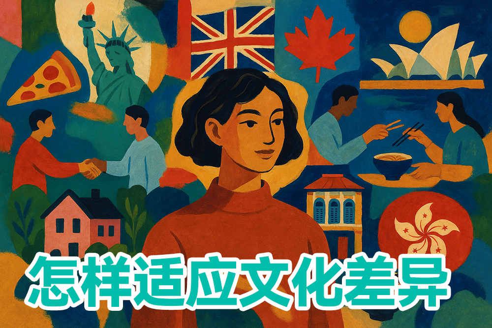

选择出国留学，意味着你将踏入一个全新的文化环境，这既是一次学术探索，也是一场深刻的文化浸润体验。不同国家的生活方式、社交习惯、教育理念、饮食文化存在显著差异，这些差异不仅会影响你的日常生活，更会深刻塑造你的留学体验质量。根据我们的调查，超过85%的留学生表示，文化适应是他们面临的首要挑战，甚至超过了语言障碍和学业压力。

提前了解这些文化差异并做好心理准备，能让你的留学之旅更加顺畅，也能帮助你更快地融入当地社会，充分享受跨文化学习的乐趣。予果予实留学顾问团队汇集了数百位归国留学生的第一手经验和反馈，结合最新的跨文化研究成果，为大家带来这份详尽的主流留学国家环境与文化解析。

## 美国：多元文化的熔炉

美国作为全球最受欢迎的留学目的地，每年接收超过100万国际学生，其多元文化环境既是最大特色，也是最大挑战。在这个由移民构建的国家，你将体验到前所未有的文化多样性，同时也需要适应其独特的社会规则和生活方式。

### 校园文化与学术环境

美国大学校园是一个微型社会，拥有丰富多彩的活动和独特的文化氛围：

- **学术自由与互动**：美国高等教育强调批判性思维和课堂参与，教授通常欢迎学生提问和挑战观点。这与许多亚洲国家的教育模式有显著不同，初到美国的留学生可能需要时间适应这种互动式学习方式。一位在麻省理工学院就读的中国学生分享："刚开始我很不习惯课堂上的辩论氛围，总觉得质疑教授是不礼貌的，但后来发现这恰恰是美国教育最宝贵的部分。"

- **社团与课外活动**：美国大学平均有200-300个学生组织，从学术俱乐部到体育团队，从志愿服务到艺术表演，选择极为丰富。这些活动不仅是社交的重要渠道，也是培养领导力和团队合作能力的宝贵平台。研究表明，积极参与课外活动的国际学生，其文化适应速度比不参与活动的学生快40%。

- **学术诚信要求**：美国大学对学术诚信的要求极为严格，抄袭和作弊可能导致严重后果，甚至开除。确保充分了解并遵守学校的学术诚信政策，包括正确引用和参考文献格式。

### 日常生活与文化适应

美国的日常生活方式有其独特之处，了解这些差异有助于更顺利地适应：

- **饮食文化多样性**：虽然美式快餐以高热量、大份量著称，但美国实际上拥有极为多样的饮食选择。大城市和大学城通常有各国美食，满足不同口味需求。不过，食材和烹饪方式与亚洲有显著差异，建议学习基本烹饪技能，既解思乡之情，也能控制饮食健康。一项针对中国留学生的调查显示，83%的学生在美国第一年体重有所变化，其中58%增重，25%减重。

- **交通与出行**：除纽约、波士顿、旧金山等少数城市外，美国大多数地区公共交通系统不够发达，私家车是主要出行方式。初到美国，建议了解当地公共交通选项、共享单车/汽车服务，或考虑与同学拼车。在某些州，国际驾照可以使用一段时间，但长期居住需考取当地驾照。

- **小费文化**：美国服务业有强烈的小费文化，餐厅通常需支付15-20%的小费，这实际上是服务人员收入的重要部分。不给小费在美国被视为极不礼貌的行为。

### 社交互动与人际关系

美国的社交方式有其特定规则和期望，了解这些有助于建立健康的人际关系：

- **直接开放的交流方式**：美国人社交风格普遍直接开放，初次见面喜欢聊天气、体育、娱乐和旅行等轻松话题，通常避免政治、宗教和个人收入等敏感话题。美国人重视眼神接触和自信的肢体语言，这在某些文化中可能被视为过于直接，但在美国是表达诚意和自信的重要方式。

- **个人空间与界限**：美国人通常重视个人空间，社交距离比许多亚洲和拉丁美洲国家更大。初次见面通常以握手为礼，熟人之间可能拥抱，但亲吻面颊在大多数场合不常见。

- **建立跨文化友谊**：研究表明，与当地学生建立友谊的国际学生，其语言能力提升更快，文化适应更顺利。然而，这需要主动努力和文化敏感性。一位在芝加哥大学就读的日本学生分享："刚开始我总是等别人来找我聊天，结果很少有人主动接近。后来我开始参加学校活动，主动提问和分享，慢慢建立了真正的友谊。"

> 在美国，独立自主的生活能力和积极主动的社交态度，是适应环境的关键因素。文化冲击是不可避免的，但通过开放的心态和积极的适应策略，你可以将这种冲击转化为个人成长的宝贵机会。

## 英国：传统与现代的完美融合

英国作为现代高等教育的发源地之一，拥有牛津、剑桥等世界上最古老的大学，其教育体系和社会文化既保留了深厚的历史传统，又融入了现代元素。每年约有50万国际学生选择英国留学，其中来自中国、印度和美国的学生占比最高。

### 独特的教育体系与学术文化

英国的教育模式与许多国家有显著差异，了解这些特点有助于更好地适应学习环境：

- **导师制与独立研究**：英国高等教育特别是牛津、剑桥等古老大学保留了传统的导师制(Tutorial System)，学生定期与导师进行一对一或小组讨论。这种教学方式强调批判性思维和独立研究能力，要求学生在课前大量阅读并准备讨论材料。一位在牛津大学就读的国际学生分享："最初我很不适应每周要写一篇论文并与导师讨论的节奏，但这种高强度训练极大提升了我的分析能力和学术自信。"

- **紧凑的学制与高强度学习**：与美国相比，英国学制显著短，本科通常为3年（苏格兰为4年），硕士仅为1年。这意味着课程进度快、学习强度大，要求学生具备出色的时间管理能力。研究显示，约40%的国际学生在英国留学初期面临学业压力，适应这种紧凑学制是最大挑战之一。

- **学术写作与引用规范**：英国大学对学术诚信和写作规范要求极高，抄袭被视为严重学术不端行为。不同学科可能采用不同的引用格式（如Harvard、APA、MLA等），建议提前熟悉所在专业的学术写作要求。许多大学提供专门的学术写作指导服务，新生应积极利用这些资源。

### 英伦生活与文化特点

英国的日常生活有其独特的文化特点和社会规范，了解这些有助于更顺利地融入当地社会：

- **英式礼仪与社交规则**：英国人普遍注重礼仪和隐私，社交场合保持适当距离是基本礼貌。与美国的直接开放不同，英国人初次社交可能显得较为含蓄和保守，但这不代表不友好，而是一种文化差异。英国人重视准时，社交和商务场合迟到被视为不尊重。一位文化研究学者指出："英国人的社交距离比地中海国家大，但比北欧国家小，了解这种微妙差异有助于避免社交尴尬。"

- **排队文化与公共秩序**：排队文化在英国根深蒂固，无论是在公交站、超市、银行还是酒吧，都需要自觉排队等候。插队行为会受到强烈谴责，即使不会直接指出。这种对公共秩序的尊重反映了英国社会的核心价值观之一。

- **地区差异与多元文化**：英国虽然国土面积不大，但各地区文化差异显著。苏格兰、威尔士、北爱尔兰和英格兰各有独特的文化传统和认同感。同时，伦敦、曼彻斯特、伯明翰等大城市是全球最多元化的城市之一，拥有来自世界各地的社区和美食。这种多元性为国际学生提供了丰富的文化体验，也使融入当地社会变得相对容易。

### 实用生活指南

- **应对英国天气**：英国以多变、多雨和阴天著称，特别是冬季日照时间短（最短时每天仅7-8小时），可能导致季节性情绪障碍。建议投资一件高质量防水外套，随身携带折叠伞，多参加室内活动，保持积极心态。冬季可考虑补充维生素D，或使用光疗灯缓解情绪低落。一项针对国际学生的调查显示，约30%的学生在英国第一个冬季经历了不同程度的情绪波动。

- **医疗与健康服务**：英国的国民医疗服务体系(NHS)为国际学生提供医疗保障，但需要支付国际健康附加费(Immigration Health Surcharge)。抵达后应尽快向当地全科医生(GP)注册，这是获得大多数医疗服务的前提。英国处方药价格相对较高，建议购买适当的旅行保险作为补充。

- **交通与出行**：英国公共交通系统发达但价格不菲，建议申请学生优惠卡(如16-25 Railcard)可节省1/3火车票费用。伦敦交通费用特别高，但可使用Oyster卡或非接触式支付享受每日封顶价格。注意英国靠左行驶，过马路时需特别注意交通方向。

> 在英国留学，适应其独特的教育方式和社会礼仪，是融入当地生活的重要一步。

## 澳大利亚：阳光与活力的国度

澳大利亚作为南半球最受欢迎的留学目的地，每年吸引约40万国际学生，其中中国、印度和东南亚国家学生占比最高。澳洲独特的地理位置、宜人的气候和轻松的生活方式，加上高质量的教育体系和友好的移民政策，使其成为留学生的理想选择。

### 教育体系与学术特点

澳大利亚的教育体系融合了英国传统与美国创新的特点，形成了独具特色的学术环境：

- **实践导向的教学方法**：澳洲大学强调理论与实践相结合，课程设计通常包含大量实践项目、实习机会和行业合作。这种教学方式特别适合应用型学科，如工程、IT、商科和设计等。一位在悉尼大学就读工程专业的留学生分享："澳洲的课程设计非常注重实际应用能力，几乎每门专业课都有与行业合作的项目，这让我在毕业前就积累了丰富的实战经验。"

- **小组合作与讨论**：澳洲大学课程通常包含大量小组作业和讨论环节，培养学生的团队合作和跨文化沟通能力。这对于习惯独立学习的亚洲学生可能是一个挑战，但也是提升软技能的宝贵机会。研究表明，约60%的国际学生在适应这种合作学习模式时遇到初期困难，但最终95%的学生认为这显著提升了他们的沟通能力。

- **严格的学术诚信要求**：与其他西方国家类似，澳洲大学对学术诚信有严格要求，抄袭和作弊行为可能导致严重后果。大多数大学使用Turnitin等反抄袭软件检查学生作业，建议熟悉正确的引用格式和学术写作规范。

### 生活方式与文化特点

澳大利亚独特的生活方式和文化氛围是其吸引力的重要组成部分：

- **户外活动与健康生活**：澳大利亚人热爱户外活动，得益于全年300多天的阳光和壮丽的自然环境。周末的海滩活动、公园烧烤、徒步旅行和各类水上运动是社交生活的重要部分。积极参与这些活动不仅有益身心健康，也是结交当地朋友的绝佳机会。一项针对国际学生的调查显示，定期参与户外活动的留学生报告的幸福感和文化适应度显著高于不参与者。

- **咖啡文化与社交习惯**：澳大利亚拥有世界级的咖啡文化，特别是墨尔本和悉尼的咖啡品质享誉全球。咖啡馆是社交、学习和商务会议的重要场所。了解基本的咖啡术语（如Flat White、Long Black等）有助于融入当地生活。澳洲人社交风格直接友好，初次见面通常以握手为礼，熟人之间可能拥抱或贴面，称呼通常使用名字而非姓氏，即使是对教授和上司。

- **多元文化与包容性**：作为一个移民国家，澳大利亚社会高度多元化，尤其在悉尼、墨尔本等大城市，几乎可以找到世界各地的文化社区和美食。这种多元环境使国际学生较容易找到文化认同感，同时体验多样文化。各大城市定期举办多元文化节、农贸市场和社区活动，这些都是了解当地文化的好机会。

### 实用生活指南

- **气候与着装**：澳大利亚气候因地区差异显著，北部热带气候全年温暖潮湿，南部四季分明。悉尼和墨尔本的天气变化多端，"一天四季"的情况并不罕见，建议采用层叠式穿搭。此外，澳洲阳光强度极高，紫外线指数常年处于危险水平，户外活动必备防晒霜(SPF50+)、太阳镜和帽子。一位皮肤科医生警告："在澳洲，即使阴天也能被晒伤，防晒不是选择而是必需。"

- **住宿选择**：澳洲留学生住宿选择多样，包括校内宿舍、寄宿家庭、租房合住等。校内宿舍便利但费用较高(每周250-500澳元)；合租公寓经济实惠且自由度高(每周150-300澳元)，但需注意租房合同和押金规定；寄宿家庭(每周200-350澳元)则适合希望沉浸式体验当地文化的学生。不同城市房租差异显著，悉尼和墨尔本房价远高于阿德莱德和布里斯班。

- **交通与出行**：澳大利亚城市间距离极远，国内旅行通常依赖飞机。城市内公共交通系统发达但覆盖有限，尤其是郊区。建议办理学生交通卡享受优惠，并下载相关交通APP(如Opal、Myki)规划行程。悉尼和墨尔本的公共交通相对完善，而布里斯班、珀斯等城市可能需要考虑购买二手车。值得注意的是，澳洲靠左行驶，初到者过马路需特别注意交通方向。

> 在澳大利亚留学，阳光、多元文化和轻松的生活节奏是最大特色，但也需适应其独特的学术要求和生活方式。

## 加拿大：友善包容的多元社会

加拿大作为全球教育质量最高的国家之一，每年吸引约65万国际学生，其友好的移民政策、高质量的教育体系和安全的社会环境使其成为留学热门选择。加拿大是一个官方双语国家（英语和法语），尤其魁北克省以法语为主要语言，这为留学生提供了独特的语言环境。

### 教育体系与学术特色

加拿大的教育体系融合了英美教育的优点，同时保持自身特色：

- **灵活的课程设置**：加拿大大学课程设置灵活，允许学生根据兴趣和职业规划自由选择课程组合。许多大学提供Co-op（带薪实习）项目，让学生在学习期间获得宝贵的工作经验。一位在多伦多大学就读的国际学生分享："加拿大的Co-op项目是我选择这里的主要原因，通过交替的学习和工作学期，我不仅减轻了经济压力，还在毕业前积累了一年的行业经验。"

- **研究与创新导向**：加拿大高度重视科研创新，大学通常拥有充足的研究经费和先进的实验设施。即使是本科生，也有机会参与教授的研究项目。这对计划继续深造的学生特别有利。据统计，约35%的加拿大国际本科生最终会继续在加拿大攻读研究生学位。

- **小班教学与导师支持**：与美国大型公立大学不同，加拿大许多大学保持较小的班级规模，特别是高年级课程，师生互动更为密切。大多数教授设有固定的办公时间(Office Hours)，鼓励学生前来讨论学术问题。

### 文化特点与社会环境

加拿大的社会文化环境有其独特之处，了解这些特点有助于更好地融入当地生活：

- **多元文化主义**：加拿大是世界上最早将多元文化主义写入国家政策的国家之一，社会高度包容不同文化背景的人群。主要城市如多伦多、温哥华和蒙特利尔是全球最多元化的城市，拥有来自世界各地的社区。一项研究显示，超过85%的国际学生认为加拿大是最容易融入的留学目的地之一。

- **社会礼仪与价值观**：加拿大人普遍友好礼貌，重视个人隐私和平等。排队文化与英国类似，公共场合保持安静也是基本礼仪。加拿大社会高度重视环保意识，垃圾分类和资源回收是日常生活的重要部分。一位文化研究学者指出："加拿大人的友善通常表现为尊重而非过度热情，他们重视个人空间，但在你需要帮助时总会伸出援手。"

- **双语环境与地区差异**：虽然英语在大部分地区是主要语言，但魁北克省（特别是蒙特利尔）以法语为主。不同省份的文化特色也有显著差异：BC省（温哥华）受亚洲文化影响较大；魁北克保留了浓厚的法国文化特色；大西洋沿岸省份则有独特的海洋文化传统。这种多样性为留学生提供了丰富的文化体验。

### 气候适应与生活实用指南

- **极端气候应对策略**：加拿大冬季极为寒冷，尤其内陆省份，温度可降至-30°C以下。专业的防寒装备不是奢侈而是必需：防水防风的外套、保暖内衣、防滑雪地靴、羊毛袜、保暖帽、手套和围巾是基本配置。一位在曼尼托巴大学（温尼伯）就读的留学生建议："投资一件真正防寒的外套（如Canada Goose或同等品质）虽然昂贵，但绝对值得。另外，'洋葱式'分层穿衣法比单件厚重衣物更有效。"

- **住宿与交通**：加拿大主要城市房租较高，特别是温哥华和多伦多。校内宿舍通常只保证一年级学生入住，之后多数学生选择校外租房。合租是经济实惠的选择，但需提前了解租赁法规和租户权益。冬季出行需特别注意安全，建议使用公共交通或拼车服务。许多城市设有完善的地下通道系统（如多伦多PATH系统、蒙特利尔地下城），可在严冬避免室外行走。

- **医疗保险与健康服务**：加拿大各省对国际学生的医疗保险政策不同。BC省、阿尔伯塔省、曼尼托巴省、新斯科舍省等允许国际学生参与省级医疗保险计划，而安大略省等则要求学生购买私人保险。了解所在省份的具体政策至关重要。大多数大学校园内设有健康中心，提供基本医疗服务和心理咨询。紧急情况拨打911可获得免费救护车服务。

- **打工与移民机会**：加拿大允许持有学习许可的国际学生校内外打工，每周最多20小时，假期可全职工作。毕业后可申请长达3年的毕业工作许可(PGWP)，这为希望移民的学生提供了宝贵的加拿大工作经验。加拿大的快速通道(Express Entry)移民系统对有加拿大学历和工作经验的申请人给予较高评分，使留学生拥有较大移民优势。

> 在加拿大留学，你将体验到高质量的教育、包容的社会环境和丰富的文化多样性，同时也需要适应严寒的冬季气候。

## 新加坡与香港：亚洲留学的理想选择

新加坡和香港作为亚洲国际化程度最高的地区，凭借其世界级大学、多元文化环境和独特的东西方文化交融特点，成为亚洲留学的热门选择。这两个地区每年共吸引约15万国际学生，其中来自中国内地、马来西亚、印度和韩国的学生占比最高。

### 教育体系与学术特色

新加坡和香港的高等教育体系融合了东西方教育精华，形成了独特的学术环境：

- **世界级的教育质量**：新加坡国立大学、南洋理工大学、香港大学和香港科技大学等院校在全球排名中常年位居前列，尤其在商科、工程、计算机科学等领域享有盛誉。这些大学采用全英文教学，聘请国际一流师资，学术标准与欧美顶尖大学接轨。一位在新加坡国立大学就读的留学生分享："这里的教育既有英美高校的严谨与创新，又融入了亚洲特有的实用主义导向，课程设计非常注重培养解决实际问题的能力。"

- **严格的学术要求**：两地大学普遍实行严格的淘汰制和高标准的学业要求。新加坡采用CAP（Cumulative Average Point）评分系统，香港则使用GPA系统，两者都设有最低学术要求，未达标准可能面临留级或退学。这种高压环境培养了学生的自律性和竞争意识，但也可能带来较大的学业压力。据调查，约65%的国际学生认为这两地的学业压力显著高于其他留学目的地。

- **研究与创新机会**：两地政府高度重视科研投入，设立了众多研究中心和创新孵化器。新加坡的生物医药、人工智能和清洁能源研究处于亚洲领先地位；香港则在金融科技、物流和创意产业研究方面表现突出。本科生通常有机会参与教授的研究项目或政府资助的创新计划，这为学术发展提供了宝贵平台。

### 文化环境与生活特点

新加坡和香港的文化环境兼具东西方特色，为留学生提供了独特的文化体验：

- **多元文化与语言环境**：新加坡是一个多元种族国家，华人、马来人、印度人和欧亚裔共同构成其多彩文化。官方语言包括英语、华语、马来语和泰米尔语，街头标识通常为多语种。香港则保留了浓厚的粤语文化和中国传统，同时融入了150多年的英国殖民地影响，形成独特的中西合璧文化。这种多元环境既减轻了亚洲学生的文化冲击，又提供了丰富的跨文化学习机会。

- **社会规范与价值观**：两地社会都高度重视秩序、效率和集体主义价值观，犯罪率极低，公共设施完善。新加坡以严格的社会管理著称，对公共行为有明确规范，如禁止在公共场所吃口香糖、随地吐痰等，违规可能面临高额罚款。香港则相对自由开放，但同样注重公共秩序。一位文化研究学者指出："在新加坡和香港，你能体验到亚洲传统价值观与现代都市生活的完美融合，这种平衡为国际学生提供了安全感和文化认同感。"

- **饮食文化与社交活动**：两地都是美食天堂，融合了中华、马来、印度、西方等多种烹饪传统。新加坡的小贩中心(Hawker Centre)和香港的茶餐厅是体验当地饮食文化的最佳场所，价格亲民且选择丰富。社交活动方面，两地都有丰富的夜生活和文化活动，从传统节庆到现代艺术展览，应有尽有。周末短途旅行选择也很丰富，新加坡学生可轻松前往马来西亚、印尼和泰国；香港学生则可便捷访问中国内地和澳门。

### 实用生活指南

- **气候与健康**：两地都属于热带或亚热带气候，全年高温多雨，湿度较大。新加坡终年如夏，平均温度在23-32°C之间；香港则有较明显的季节变化，夏季炎热潮湿，冬季相对凉爽干燥。高温高湿环境可能导致中暑、皮肤问题和呼吸道不适，建议适当使用空调，保持室内通风，注意补充水分。一位热带医学专家建议："在这种气候下，保持充分水分摄入和电解质平衡至关重要，尤其是刚到的留学生，应避免长时间户外活动，直到身体适应当地气候。"

- **住宿与交通**：两地房价和租金在亚洲乃至全球都处于顶级水平。大学通常提供有限的校内宿舍，竞争激烈。校外租房选择包括合租公寓、服务式公寓和寄宿家庭，月租金从1000-3000新元/港币不等，取决于位置和条件。公共交通系统高度发达，新加坡的MRT（地铁）和公交系统覆盖全岛；香港的MTR（地铁）、巴士和电车网络同样便捷高效。两地都提供学生交通卡优惠，大幅降低出行成本。

- **留学成本与打工机会**：新加坡和香港的留学总成本（包括学费和生活费）通常比美英澳低20-30%，但仍高于欧洲大陆和日本。新加坡政府为优秀国际学生提供多种奖学金，如新加坡国际奖学金(SIA)和科研奖学金；香港也有香港博士奖学金计划(HKPFS)等资助项目。两地都允许国际学生在特定条件下校内外打工，新加坡学生签证持有者每周可工作16小时，香港则允许全日制学生每周工作20小时。毕业后，两地都提供一定期限的就业签证，方便国际学生寻找工作。

> 在新加坡和香港留学，你将体验到亚洲效率与国际视野的完美结合。这里既有熟悉的东方文化元素，又有开放的国际化环境，是亚洲学生迈向国际舞台的理想跳板，也是西方学生了解亚洲的绝佳窗口。

## 留学生活适应建议：从文化冲击到成功融入

无论选择哪个国家留学，跨文化适应都是一个复杂而漫长的过程。研究表明，大多数留学生会经历"蜜月期→文化冲击期→适应期→融入期"四个阶段。以下是帮助你顺利度过这一过程的全面指南：

### 出发前的准备工作

1. **深入了解目的地文化**：不仅要了解表面的文化符号（如饮食、节日），更要理解深层次的文化价值观和社会规范。推荐阅读目的地国家的历史、文学作品和时事新闻，观看当地电影和纪录片。一位教育顾问建议："每天花30分钟阅读目的地国家的新闻，三个月后你会对当地社会有相当深入的理解。"

2. **语言强化训练**：除了提高学术语言能力，特别要注重日常交流用语、俚语和幽默表达。研究显示，掌握100个当地最常用俚语和表达方式能显著提升社交融入度。可以通过语言交换应用（如Tandem、HelloTalk）与当地人练习口语，或观看不带字幕的当地电视节目提高听力理解能力。

3. **建立现实期望**：避免过度理想化或妖魔化目的地国家。与已在该国留学的学长学姐交流，了解真实的留学体验和可能面临的挑战。一位心理学家指出："不切实际的期望是文化冲击的主要来源之一。"

4. **模拟生活场景**：提前练习在目的地国家可能遇到的日常生活场景，如用当地语言点餐、询问路线、处理紧急情况等。有条件的话，可以参加模拟跨文化体验工作坊。

### 初到异国的适应策略

1. **克服初期不适**：抵达后的前几周通常是最困难的时期，可能出现时差反应、饮食不适和思乡情绪。建立规律作息，逐步调整饮食习惯，给自己足够的休息时间。研究表明，保持充足睡眠（每天7-8小时）能显著降低初期适应压力。

2. **创建熟悉感**：在新环境中创造一些熟悉的元素，如布置房间时放置家乡的照片或物品，找到供应家乡食材的商店。一位文化适应专家解释："在陌生环境中保留一些熟悉元素，能为大脑提供安全感和稳定性，减轻适应压力。"

3. **主动探索与观察**：制定探索计划，每周探索一个新地方，观察当地人的行为方式和交流模式。一位成功适应的留学生分享："我每周末都会选择一个新的社区探索，不仅了解了城市，还学会了当地人的生活方式。"

4. **建立支持网络**：积极参与迎新活动、学生社团和志愿服务，结交不同背景的朋友。研究显示，拥有多元化社交网络（包括当地学生、其他国际学生和同胞）的留学生适应能力最强。特别建议加入至少一个与专业相关的社团和一个纯兴趣爱好的社团。

### 深度融入与文化适应

1. **跨文化沟通技巧**：学习并实践跨文化沟通的核心技能，包括：
   - 积极倾听而非假设
   - 观察非语言线索（肢体语言、表情）
   - 直接询问而非猜测文化规范
   - 在误解发生时保持开放态度
   
   一位跨文化交流专家建议："当你不确定某个行为是否得体时，简单直接地询问'在你们文化中，这样做合适吗？'往往能避免许多尴尬。"

2. **语言沉浸**：尽量创造全天候的语言学习环境，如更改手机和电脑语言设置，收听当地广播，参加语言角活动。研究表明，每天至少3小时的目标语言环境浸泡能显著加速语言适应。

3. **文化参与**：超越"旅游者"心态，深入参与当地文化活动，如家庭寄宿、传统节日庆典、社区服务等。一位文化人类学家指出："真正的文化理解来自参与而非观察，来自互动而非旁观。"

4. **反思与调整**：定期反思自己的文化适应过程，记录文化冲突经历和解决方法。研究显示，保持"文化适应日记"的留学生比没有这一习惯的学生适应速度快30%。

### 心理健康与自我关怀

1. **识别文化冲击症状**：了解并正视文化冲击的常见症状，如焦虑、失眠、易怒、社交退缩、过度思念家乡等。心理学研究表明，约70%的留学生会经历不同程度的文化冲击，这是正常现象而非个人失败。

2. **情绪调节策略**：学习并实践有效的情绪调节方法，如：
   - 正念冥想（每天10-15分钟）
   - 深呼吸练习（4-7-8呼吸法）
   - 写作疗法（每晚记录三件感恩事项）
   - 体育锻炼（每周至少150分钟中等强度活动）
   
   一位心理健康专家强调："情绪调节能力是跨文化适应的核心技能之一，值得系统学习和日常练习。"

3. **寻求专业支持**：了解并利用学校提供的心理咨询服务，克服文化中对心理健康的误解和羞耻感。大多数大学为国际学生提供免费或低价的心理咨询服务，有些甚至提供母语咨询选项。

4. **维持联结感**：定期与家人朋友视频通话，但避免过度依赖家乡联系而忽视当地社交。研究建议，每周1-2次深度家乡联系，同时确保每周至少3次当地社交活动，能达到最佳平衡。

### 学术与职业发展

1. **了解教育差异**：主动了解并适应目的地国家的教育理念、课堂文化和学术要求。例如，美国重视课堂参与和批判性思维，英国强调独立研究能力，亚洲国家可能更注重考试成绩。一位教育比较学者建议："在第一堂课前，阅读该国的教育特点介绍，并在课后向教授请教对国际学生的具体期望。"

2. **利用校园资源**：充分利用学校提供的学术支持服务，如写作中心、学习辅导、图书馆研讨会等。数据显示，定期使用这些资源的国际学生GPA平均高0.5分。

3. **跨文化职业规划**：思考如何将跨文化经历转化为职业优势，培养全球胜任力。参加跨文化领导力项目、国际实习和志愿服务，丰富简历。一位职业顾问指出："在求职市场上，成功的跨文化适应经历本身就是一项宝贵的软技能证明。"

在EDUGROW，我们不仅提供留学申请指导，还为学生提供全方位的跨文化适应支持，包括出国前培训、在线文化适应课程和一对一咨询服务。我们相信，成功的留学体验建立在全面的准备和持续的支持之上。
